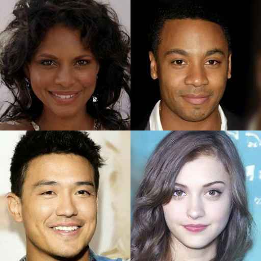
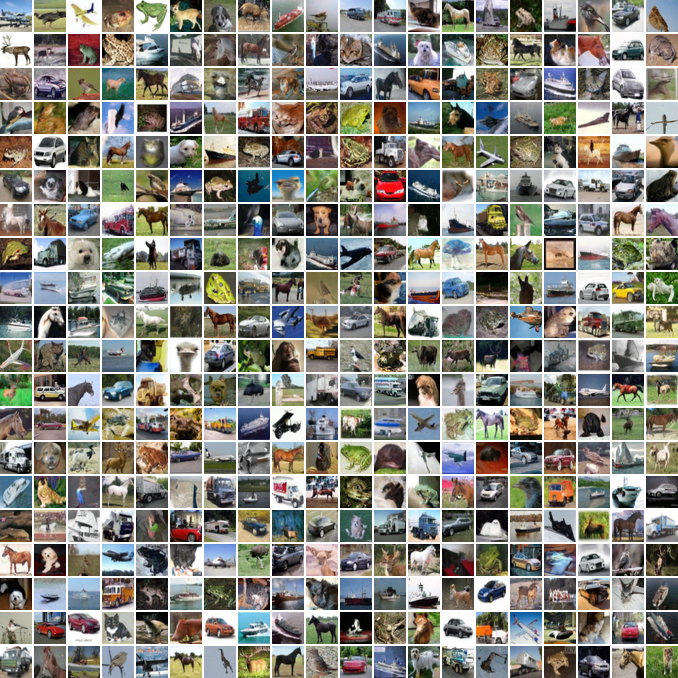

# [**Denoising Diffusion Probabilistic Models**](../../README.md#table-of-contents)
---
---
---

# [*Introduction*](../../README.md#table-of-contents)
---
---




[이미지 출처](https://arxiv.org/abs/2006.11239)

이 논문은 수학적으로 잘 정의되어 학습이 쉽지만 GAN계열 모델들의 이미지 생성 퀄리티에는 미치지는 못하던 diffusion 계열 모델을 개선하여 diffusion 모델도 비슷한 수준의 고품질 이미지를 생성할 수 있다는 것을 보였다. 또 diffusion 모델이 score-based 생성 모델과 연관이 있음을 보인다.   
  
위 예시 사진에서 보이듯 diffusion 모델은 높은 수준의 이미지 생성 퀄리티를 달성했지만, log likelihood 값을 계산해보면 기존의 likelihood-based 모델과 비교해 좋지 않다고 한다. 이 논문은 diffusion 모델의 상대적으로 긴 lossless codelengths 대부분이 사람 눈에 보이지 않는 미세한 디테일을 묘사하는데 쓰이기 때문이라고 주장한다. 
> 이는 diffusion 모델이 마치 손실 압축 처럼 눈에 보이는 중요한 특징들은 잘 압축해서 눈으로 보는 샘플 퀄리티는 좋지만, 눈에 보이지 않는 미세한 디테일들은 무시해서 픽셀 단위로 미세한 디테일까지 (각 픽셀의 값 1~2의 차이) 얼마나 잘 복원했는가 평가하는 log likelihood 값은 나쁘게 나온다는 것
>> 무손실 압축(lossless compression)을 진행한다고 할 때, 특정 데이터가 압축 된 후의 길이(몇 비트인지)를 codelength라 한다. 이 때, 자주 반복해서 나오는 데이터는 길이가 짧은(작은 codelength) code로 압축하고 거의 나오지 않는 데이터는 긴 code로 변환해야 압축 결과물의 총 code 길이가 짧아진다(용량이 작다)
>>     
>> 클로드 섀넌의 정보이론에 따르면 어떤 데이터 $`x`$가 등장할 확률이 $`p(x)`$이면, 이 데이터를 무손실 압축하기 위해 필요한 codelength의 이론적 최소값은 
>> ```math
>> \text{Codelength} = -\log p(x)
>> ```
>> 이다.   
>> 이 $`-\log p(x)`$값은 모델을 학습할 때 계산하는 Negative Log-likelihood(NLL)값
>> ```math
>> \text{NLL} = -\log p(x)
>> ```
>> 과 완전히 동일하다. 따라서 log likelihood 값으로 모델을 평가한다는 것은 모델이 무손실 압축을 얼마나 잘하고 있는가를 기준으로 평가하는 것이라고 볼 수 있다.  
>> lossless codelengths 대부분이 사람 눈에 보이지 않는 미세한 디테일을 묘사하는데 쓰인다고 하는 것은:  
>>> 이미지 샘플 퀄리티에 중요한 사람 눈에 보이는 중요한 특징들은 diffusion 모델이 이 특징들을 잘 학습해서(모델 $`q(x)`$가 $`p(x)`$값을 잘 예측해서) 짧은 codelength로 압축한다. 그러나 픽셀 단위의 국소적인 패턴(질감 - local texture)을 잘 학습하지 못하기 때문에 미세 고주파 노이즈 패턴 $`x`$에 대해 그 패턴의 실제 등장확률 $`p(x)`$ 보다 훨씬 작은 $`q(x)`$값을 할당하게 되고 codelength 결과값이 매우 커지게 된다
>>>> 데이터셋에서 특정한 국소패턴이 더 자주 등장하는 것(ex: CelebA셋의 경우 사람 피부 결, 머리카락이 연속되는 패턴 등의 미세 디테일)을 잘 배우지 못한 모델은 MSE loss로 학습하는 특성상 0~255 픽셀 범위에서 중간값인 128만 예측해서 loss를 최소화하려고 한다.  
>>>>
>>>> diffusion 모델은 설계 단계부터 무조건 Gaussian 종 모양 형태로 분포를 만들기 때문에 128을 중심으로 높게 솟는 종 모양 분포가 된다. 그 결과로 정답이 128 중간값에서 벗어나는 값(흰색이나 검정에 가까운 값)일 수록 예측하는 확률은 엄청나게 작아진다. cross entropy는 실제 발생확률이 높은 사건(여기서는 패턴)을 모델이 발생확률이 낮다고 잘못 판단했을 때 더 큰 페널티를 준다.
>>>>> 기존의 PixelCNN과 같은 likelihood 계열 모델은 픽셀 값을 256개의 독립적인 카테고리로 보고 학습 해 Gaussian이 아닌 다봉 분포(multimodal)을 정상적으로 학습 가능하다.  
>>>
>>> 논문의 4.3 절에서 CIFAR 10 데이터셋으로 실험한 결과, 이미지를 압축한 전체 codelengths의 절반 이상이 눈에 보이지 않는 미세 고주파 패턴을 압축한 codelength 부분임을 보인다.

따라서 논문은 diffusion 모델을 무손실 압축을 가정하는 log likelihood 평가 기준 대신 손실 압축의 관점에서 평가해야 한다고 말한다. 이 관점에서 보면 diffusion 모델은 기존의 Autoregressive 모델에서 일반적으로 가능했던 수준을 넘어 광범위하게 일반화된 비트 순서(Bit ordering)를 따르는 자기회귀 디코딩과 유사한 점진적 디코딩이라는 것.
> bit ordering은 어떤 정보를 우선적으로 압축하는지를 정하는 순서 기준
>> 기존의 PixelCNN 같은 autoregressive 모델들은 spatial ordering으로 첫번째 픽셀 -> 그 옆 두번째 픽셀 -> 그 옆 세번째 픽셀 -> ... 와 같이 공간적인 위치를 기준으로 순서를 정해 압축을 진행한다. 이러한 방식은 픽셀 단위의 미세한 질감은 잘 맞추지만 전체적인 형태를 잘 맞추지 못해 눈이 3개가 된다던가, 형태가 일그러진다던가 하는 문제들이 발생한다.
>  
>> diffusion 모델은 처음부터 이미지 전체 크기의 노이즈에서 시작해 T step 동안 점진적으로 이미지 전체를 변화시키는 방식으로 초반 t step (t ~ T)에는 대상의 윤곽, 배경의 대략적인 색상 등 중요한 뼈대가 되는 거시적 정보부터 먼저 보고 후반 t step (t ~ 0) 에 마지막으로 피부 질감, 매끈한 표면의 반사광 등 미세한 디테일을 처리한다. 이러한 bit ordering은 인간이 그림을 그리는 방식에 더 유사한 정보의 순서 기준이라고 볼 수 있다.  
> 
> 따라서 논문에서 말하는 광범위하게 일반화된 비트 순서(Bit ordering)란 단순히 픽셀 순서대로 정하는 것이 아닌 정보의 중요도를 기준으로 하는 고차원적인 비트 순서를 말한다.

> ---
> ## [*Codelength, entropy, cross entropy*](../../README.md#table-of-contents)
>
> ### Codelength  
> 데이터 $`x`$ 하나를 무손실 압축할 때 이상적인 코드길이는 $`-\log p(x)`$이다. 
>> 클로드 새넌의 정보 이론은 필요한 정보를 가장 효율적으로 압축하고 통신하는 방법에 대해 다루며 이를 위해 정보를 계량화한다. 어떤 사건의 정보량을 계산한다는 것은 이 사건을 효율적으로 저장하기 위해(또는 전달하기 위해) 몇 비트(bit)의 저장 공간이 필요한가를 묻는 것과 같다.  
>>
>> "해가 동쪽에서 뜬다."와 같이 발생 가능성이 큰(거의 항상 일어나는) 데이터는 굳이 전송할 필요가 없을 정도로 정보가 적고 "오늘 개기 일식이 발생한다."와 같이 발생 가능성이 작은 경우는 더 많은 정보량을 지니고 있다고 볼 수 있다. 또 서로 아무런 연관이 없는(독립인) 1MB짜리 텍스트 문서와 20MB짜리 이미지를 같이 전송 한다고 하면 전송 과정에 필요한 용량은 당연히 둘의 용량을 합친 21MB가 된다.  
>>
>> 정보를 계량화하기 위해서 위와 같이 필요한 성질들을 설정해보면
>> 1. 발생 가능성이 큰 사건은 정보량이 적어야 한다. 반드시 발생하는 사건에는 아무런 정보가 없어야 한다.
>> 2. 발생 가능성이 낮은 사건은 더 많은 정보량을 갖는다.
>> 3. 독립 사건의 정보량을 더할 수 있어야 한다.  
>>
>> 이 성질들을 만족하는 $`x`$ 의 자기정보(self-information) $`I(x)`$를 정의하면,
>> ```math
>> I(x) = -\log p(x)
>> ```
>> 이 된다.
>>> 사건이 가지는 정보량 계량화할 때, 가장 단순하게 사건이 일어날 확률값을 그대로 사용해볼 수 있다.($`I(x) = p(x)`$) 하지만 이렇게 하면 독립인 두 사건이 같이 일어날 확률은 두 사건이 각각 일어날 확률의 곱이므로 3번의 덧셈 성질을 만족하지 않는다. 여기서 log 함수의 성질
>>> ```math
>>> \log(x \times y) = \log(x) + \log(y)
>>> ```
>>> 을 이용해 정보량을 $`I(x) = \log p(x)`$로 설정해보면, 독립인 두 사건 $`x`$, $`y`$이 동시에 일어날 때 정보량은 
>>> ```math
>>> I(x,y) = \log p(x,y) = \log (p(x)p(y)) = \log p(x) + \log p(y) = I(x) + I(y)
>>> ```
>>> 로 계산되어 각각 사건의 정보량의 합으로 잘 표현되는 것을 확인할 수 있다.  
>>> 마지막으로 $`I(x) = -\log p(x)`$로 마이너스만 추가해주면 발생가능성이 매우 큰 사건의 정보량은 0에 가깝고, 발생 가능성이 매우 작은 사건의 정보량은 양의 무한대로 발산하게 되어 1, 2번의 성질도 잘 만족하게 된다.
>
>> codelength를 계산할 때의 log의 밑을 2로 쓰면 단위는 bit, 자연상수 $`e`$를 쓰면 nat, 10을 쓰면 dit가 된다. 주로 통신, 보안 분야에서는 bit를 사용하고 가우시안 분포와 같은 연속 확률 분포(e^x 형태 등이 나오는)를 사용하는 머신러닝 분야에서는 nat를 사용한다.
> 
> ### Entropy
> 엔트로피는 데이터셋의 평균 codelength 값이다.
>>  데이터 하나가 아니라 확률 분포 $`P`$를 따르는 데이터셋을 다룰 때 데이터 각각의 codelength를 모두 구한 후 평균을 낸 값을 entropy로 정의한다. 
>> ```math
>> H(X) = \mathbb{E}_{x \sim P} [-\log p(x)] = -\sum p(x) \log p(x)
>> ```
>> $`-\log p(x)`$가 데이터 하나를 무손실 압축할 때 이론적인 최소길이이므로 $`H(X)`$는 데이터셋을 무손실 압축할 때 필요한 평균 코드 길이의 이론적인 최소값이다.  
> 
>> 엔트로피의 크기는 분포의 특성에 따라 달라진다. 예를 들어 a, b, c, d 4개 문자로 이루어진 데이터셋이 있다고 하자. 이 때 4 문자 중 하나를 뽑을 확률이 모두 동일한 균등 분포일 경우 엔트로피는
>> ```math
>> H = - [\frac{1}{4}\log_{2}\frac{1}{4} + \frac{1}{4}\log_{2}\frac{1}{4} + \frac{1}{4}\log_{2}\frac{1}{4} + \frac{1}{4}\log_{2}\frac{1}{4}] = 2\ bits
>> ```
>> 이지만 불균등한 분포여서 $`p(a) = 0.7,\ p(b)= 0.25,\ p(c)= 0.03,\ p(d)= 0.02`$일 경우 
>> ```math
>> H = - [0.7\log_{2}0.7 + 0.25\log_{2}0.25+ 0.03\log_{2}0.03 + 0.02\log_{2}0.02] \approx 1.125\ bits
>> ```
>> 가 되어 엔트로피(평균 정보량)이 줄어든다.  
>> 이는 균등분포일 때는 4 문자의 발생 확률이 똑같아 어느 문자가 나올지 결과를 예측하기 어렵고, 불균등 분포일 때는 특정 기호(a)의 발생 확률이 제일 커서 결과를 예측하기 쉬우므로 필요한 평균 비트 수가 적어진다.
>>> a, b, c, d 4 문자 데이터셋이 균등 분포일 때, 각 문자를 bit(0과 1)로 변환한다고 하면  00, 01, 10, 11 이 4가지를 각 문자에 할당할 수 있고, 이 때의 평균 코드 길이는 2 bits가 된다.  
>>> a, b, c, d 4 문자 데이터셋이 위와 같이 불균등 분포일 때는 a에는 0을, b에는 10을, c는 110, d는 111을 할당해서 변환하면 코드가 이어서 붙어있을 때 헤깔림 없이 원래의 a, b, c, d로 복원 가능하고 평균 코드 길이는 $`0.7\cdot 1 + 0.25\cdot 2 + 0.03\cdot 3 + 0.02\cdot 3 = 1.35\ bits`$가 된다.  
>>>> 균등 분포일 때, 불균등 분포처럼 a에는 0을, b에는 10을, c는 110, d는 111을 할당해서 변환해보면 평균 코드 길이가 $`0.25\cdot 1 + 0.25\cdot 2 + 0.25\cdot 3 + 0.25\cdot 3 = 2.25\ bits`$가 되어 평균 코드 길이의 이론적 최소값 2 bits보다 커지는 것을 확인해볼 수 있다.
>
> ### Cross entropy
> 크로스 엔트로피는 하나의 확률 분포에 대한 척도인 엔트로피와 다르게 두개의 확률 분포에 대한 척도이다. 머신러닝 분야에서 주어진 두 개의 확률 분포가 얼마나 비슷한지 측정할 때 사용된다.  
>> 실제 값 계산은 엔트로피와 동일하게 평균 압축 코드길이를 계산하지만, 각 데이터의 코드길이 계산에 $`P`$가 아닌 모델이 학습한 분포 $`Q`$를 사용한다.
>> ```math
>> H(P, Q) = \mathbb{E}_{x \sim P} [-\log Q(x)] = -\sum p(x) \log q(x)
>> ```
>>> Cross entropy는 전체 데이터셋에서 모델이 출력한 확률에 대한 negative log-likelihood 값의 평균이므로 NLL 평가 계산과 완전히 동일하다.
>>
>>> 대부분의 실험에서는 실제 분포 $`P`$를 모르는 상황에서 그 분포에서 얻어진 데이터셋만 가지고 있다. 이런 상황에서는 데이터 각각의 codelength와 평균 코드 길이의 이론적 최소치인 엔트로피는 계산이 불가능하다.  
>>>
>>> 하지만 크로스 엔트로피는 모델이 학습한 $`Q`$를 대신 사용해 각 데이터 별 코드 길이를 계산하고 $`P`$분포 기준으로 전체 데이터셋 평균을 하는 것도 몬테카를로 샘플링을 이용해 $`-\sum p(x) \log q(x)`$를 $`-\frac{1}{L}\sum \log q(x)`$로 변환하면 실제로 계산할 수 있다.  
>
>> 모델 학습 목표는 모델이 예측하는 분포 $`Q`$를 실제 분포 $`P`$에 최대한 가깝게 하는 것이다. 두 분포 사이의 차를 나타내는 수학적인 양으로는 Kullback-Leibler Divergence, Jensen-Shannon Divergence, Wasserstein Distance 등이 있고, 머신러닝 에서는 주로 KL div.를 많이 사용한다. 
>> ```math
>> D_{KL}(P \vert{}\vert{} Q) = \sum p(x)\log\frac{p(x)}{q(x)}
>> ```
>> 두 분포가 동일한 분포이면 이 값은 0이 되고, 값이 작을 수록 두 분포가 비슷하다고 볼 수 있으므로 값을 최소화하는 방향으로 모델을 학습하면 된다. 하지만 엔트로피와 동일하게 이 값을 직접적으로 계산하는 것이 불가능하다.  
>>
>> 이러한 상황에서 크로스 엔트로피를 분해해보면 계산 가능한 값인 크로스 엔트로피를 통해 모델을 학습하는 것이 왜 효과적인가를 알 수 있다.
>> ```math
>> \begin{aligned}
>> H(P, Q) &= -\sum p(x) \log q(x) \\
>> &= -\sum p(x) \big(\log p(x) + \log \frac{q(x)}{p(x)}\big) \\
>> &= -\sum p(x) \log p(x) - \sum p(x)\log\frac{q(x)}{p(x)} \\
>> &= -\sum p(x) \log p(x) + \sum p(x)\log\frac{p(x)}{q(x)} \\
>> &= H(P) + D_{KL}(P \vert{}\vert{} Q)
>> \end{aligned}
>> ``` 
>> KL div.는 0보다 크거나 작은 값이므로 크로스 엔트로피는 고정된 이론적 최소치인 엔트로피보다 작아질 수 없다. 따라서 크로스 엔트로피를 최소화하도록 모델을 학습하면 두 분포가 얼마나 다른지를 나타내는 $`D_{KL}(P \vert{}\vert{} Q)`$가 0이 되도록 학습하는 것과 동일하다. 즉, 크로스 엔트로피를 최소화하면 모델이 학습하는 분포 $`Q`$를 실제 분포 $`P`$에 근사하도록 할 수 있다.
>
>
> [참고 자료1](https://wikidocs.net/302426)  
> [참고 자료2](https://xxxxxxxxxxxxxxxxx.tistory.com/entry/Information-Theory)  
> [참고 자료3](https://namu.wiki/w/%EC%A0%95%EB%B3%B4%EC%9D%B4%EB%A1%A0)
