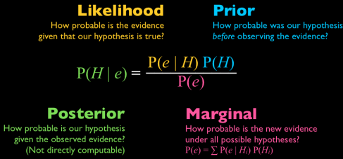
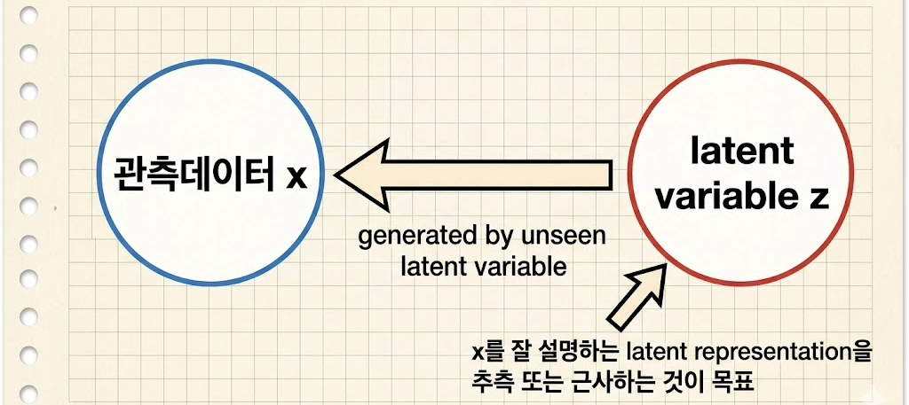
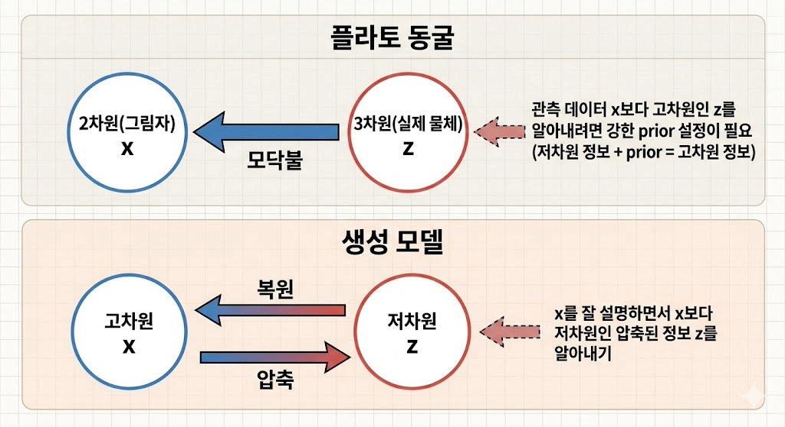
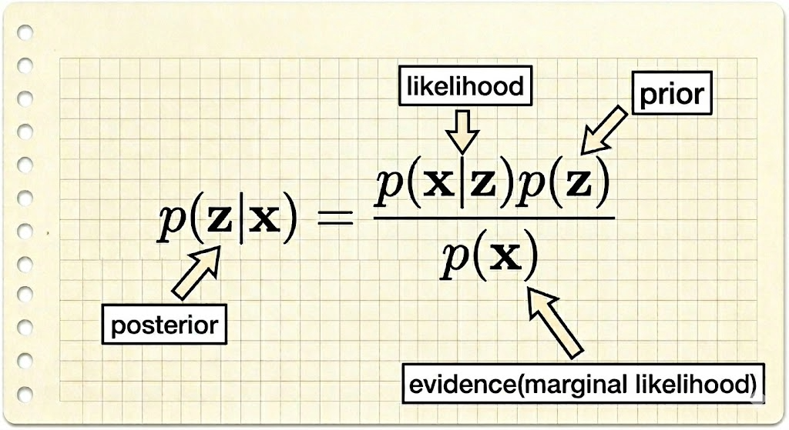

# [**Understanding Diffusion Models: A Unified Perspective**](../Table_of_contents.md#table-of-contents)
---
---
---

# [*Generative Models*](../Table_of_contents.md#table-of-contents)
---
---

표본 x가 주어진 상태
- 목표: $p(x)$ 배우기 ($p(x)$ = true data distribution)
- $p(x)$ 배운 모델 $p_{\theta}(x)$에서 sampling하면 생성
    - $p_{\theta}(x)$를 이용해 $x_{관측}$ 또는 $x_{생성}$의 우도(likelihood)도 계산 가능  
  
## **생성 모델 분류**
- GAN
- likelihood-based
    - VAE
- energy-based
    - score-based  
  
---
---

# [*Background*](../Table_of_contents.md#table-of-contents)
---
---

[베이즈 룰 이해](https://hyeongminlee.github.io/post/bnn001_bayes_rule/)  

  
[그림 출처](https://blog.naver.com/ycpiglet/223058716063)


---


  


---
---

# [*ELBO*](../Table_of_contents.md#table-of-contents)
---
---

  

## **기본 세팅**
"likelihood-based"계열 생성모델은 모든 관측값 x의 likelihood $p(x)$ (엄밀히는 marginal likelihood 또는 evidence)를 최대화하는 방향으로 학습을 한다. latent variable $z$와 observed data $x$를 joint distribution $p(x,z)$로 모델링할 경우, Equation 1, Equation 2를 통해 $p(x)$를 얻을 수 있다.
<br>
**Equation 1:**
```math
p(x) = \int p(x, z)dz
```

**Equation 2 (확률의 연쇄 법칙):**
```math
p(x) = \frac{p(x, z)}{p(z|x)}
```
<br>

그러나 $p(x)$를 직접 계산하는건 
  
- Equation1에서 모든 latent variable $z$에 대해 적분하거나
    - 복잡한 모델의 경우 intractable
- Equation2에서 ground truth latent encoder $p(z|x)$를 알아야 해서  

매우 어렵다.

=> evidence $p(x)$를 직접 계산하는 대신 Evidence의 Lower BOund 즉 ELBO를 Eq. 1, Eq. 2 에서 얻어내어 간접적으로 접근한다.  

<br>

**Equation 3 (ELBO):**  
```math
\mathbb{E}_{q_{\boldsymbol{\phi}}(z|x)}\left[\log\frac{p(x, z)}{q_{\boldsymbol{\phi}}(z|x)}\right]
```
<br>

여기서 $q_{\boldsymbol{\phi}}(z|x)$는 ground truth encoder $p(z|x)$를 모수(parameter) $\phi$를 조정해 근사하는 모델로 $q(z|x, \boldsymbol{\phi})$로도 표현가능  

<br>

**Equation 4:**  
```math
\log p(x) \geq \mathbb{E}_{q_{\boldsymbol{\phi}}(z|x)}\left[\log\frac{p(x, z)}{q_{\boldsymbol{\phi}}(z|x)}\right]
```

<br>

ELBO는 evidence의 하한이므로 ELBO를 대신 구해 최대화한다.  

---

## **ELBO 유도 1**

**Equation 5~8:**  
```math
\begin{aligned} \log p(x) & = \log \int p(x, z)dz \qquad (Eq.\ 1)\\ & = \log \int \frac{p(x, z)q_{\boldsymbol{\phi}}(z|x)}{q_{\boldsymbol{\phi}}(z|x)}dz \qquad (\text{Multiply\ by\ }1\ = \frac{q_{\boldsymbol{\phi}}(z|x)}{q_{\boldsymbol{\phi}}(z|x)}) \\ & = \log \mathbb{E}_{q_{\boldsymbol{\phi}}(z|x)}\left[\frac{p(x, z)}{q_{\boldsymbol{\phi}}(z|x)}\right] \qquad (\text{Def\ of\ Expectation\ for\ }z \sim q_{\boldsymbol{\phi}}(z|x)) \\ & \geq \mathbb{E}_{q_{\boldsymbol{\phi}}(z|x)}\left[\log \frac{p(x, z)}{q_{\boldsymbol{\phi}}(z|x)}\right] \qquad (\text{Jensen's\ Inequality}) \end{aligned}
```
<br>

이 유도방식은 Jensen's Inequality를 이용해 ELBO가 하한인 것을 보이기는 했으나 log eveidence와 ELBO가 정확하게 어떻게 엮이는지에 대해 알기에는 부족하다.  

---

## **ELBO 유도 2**  

**Equation 9~16:**  
```math
\begin{aligned} \log p(x) & = \log p(x) \int q_{\boldsymbol{\phi}}(z|x)dz \qquad (\text{Multiply\ by\ }1\ =\int q_{\boldsymbol{\phi}}(z|x)dz) \\ & = \int q_{\boldsymbol{\phi}}(z|x)(\log p(x))dz \\ & = \mathbb{E}_{q_{\boldsymbol{\phi}}(z|x)}\left[\log p(x)\right] \\ & = \mathbb{E}_{q_{\boldsymbol{\phi}}(z|x)}\left[\log\frac{p(x, z)}{p(z|x)}\right] \qquad (\text{Eq.\ 2}) \\ & = \mathbb{E}_{q_{\boldsymbol{\phi}}(z|x)}\left[\log\frac{p(x, z)q_{\boldsymbol{\phi}}(z|x)}{p(z|x)q_{\boldsymbol{\phi}}(z|x)}\right] \qquad (\text{Multiply\ by\ 1\ }= \frac{q_{\boldsymbol{\phi}}(z|x)}{q_{\boldsymbol{\phi}}(z|x)}) \\ & = \mathbb{E}_{q_{\boldsymbol{\phi}}(z|x)}\left[\log\frac{p(x, z)}{q_{\boldsymbol{\phi}}(z|x)}\right] + \mathbb{E}_{q_{\boldsymbol{\phi}}(z|x)}\left[\log\frac{q_{\boldsymbol{\phi}}(z|x)}{p(z|x)}\right] \\ & = \mathbb{E}_{q_{\boldsymbol{\phi}}(z|x)}\left[\log\frac{p(x, z)}{q_{\boldsymbol{\phi}}(z|x)}\right] + D_{\text{KL}}(q_{\boldsymbol{\phi}}(z|x) \| p(z|x)) \qquad (\text{Def\ of\ KL\ Divergence}) \\ & \geq \mathbb{E}_{q_{\boldsymbol{\phi}}(z|x)}\left[\log\frac{p(x, z)}{q_{\boldsymbol{\phi}}(z|x)}\right] \qquad (\text{KL\ Divergence\ always }\geq 0) \end{aligned}
```

<br>

### $\therefore$ log evidence = ELBO + KL div. between the approximate posterior $q_{\boldsymbol{\phi}}(z|x)$ and the true posterior $p(z|x)$
#### **log evidence - ELBO는 항상 0보다 크거나 같은 KL div. 이므로 ELBO가 항상 log evidence의 하한임을 확인 가능**

<br>

$\boldsymbol{\phi}$를 바꿔가며 $q_{\boldsymbol{\phi}}(z|x)$가 $p(z|x)$에 근사하는 것이 현재 목표.

이 목표를 수식으로 표현하면 $D_{\text{KL}}(q_{\boldsymbol{\phi}}(z|x) \| p(z|x)) \rightarrow 0$ 이 된다. 

이 KL div. 를 직접 $\phi$에 대한 함수로 계산하고 최소화하는건 $p(z|x)$를 모르므로 불가능한 상황

여기서 log evidence가 $\phi$와 무관하므로( $p(x)$는 $p(x,z)$에서 모든 z를 주변화(marginalize)해서 제거한 상태 ) $\phi$에 대해 상수취급이 가능

= > 상수 = ELBO + KL div. 인 상황이므로 ELBO를 증가시키면 KL div. 부분이 줄어든다 

#### **ELBO를 증가시키면 자연스럽게 모델이 true posterior를 근사하게 된다.**  

---
---

