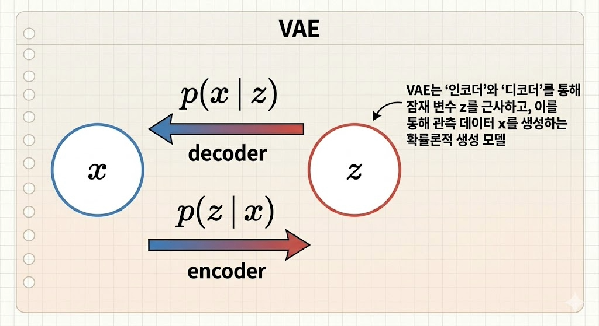
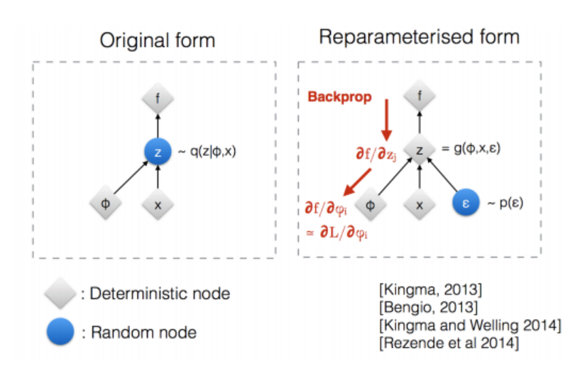
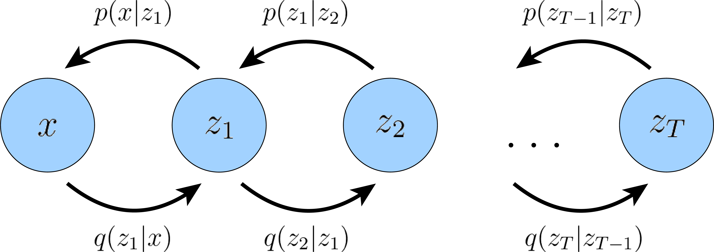

# [**Understanding Diffusion Models: A Unified Perspective**](../Table_of_contents.md#table-of-contents)
---
---
---

# [*VAE*](../Table_of_contents.md#table-of-contents)
---
---



$`\phi`$로 매개변수화된 가능한 모든 posterior의 family 에서 최적화를(= ELBO 최대화) 통해 true posterior를 잘 근사하는(= $`D_{\text{KL}}(q_{\boldsymbol{\phi}}(z|x) \| p(z|x))`$를 최소화하는) 가장 좋은 $`q_{\boldsymbol{\phi}}(z|x)`$ 를 구하므로 variational이라고 한다.

ELBO 항을 더 분해해보면 decoder $`p_{\boldsymbol{\theta}}(x|z)`$가 포함된 reconstruction term과 encoder $`q_{\boldsymbol{\phi}}(z|x)`$가 포함된  prior matching term 으로 분해된다
.

**Equation 17~19:**
```math
\begin{aligned} \mathbb{E}_{q_{\boldsymbol{\phi}}(z|x)}\left[\log\frac{p(x, z)}{q_{\boldsymbol{\phi}}(z|x)}\right] & = \mathbb{E}_{q_{\boldsymbol{\phi}}(z|x)}\left[\log\frac{p_{\boldsymbol{\theta}}(x|z)p(z)}{q_{\boldsymbol{\phi}}(z|x)}\right] \qquad (\text{Chain\ Rule\ of\ Probability}) \\ & = \mathbb{E}_{q_{\boldsymbol{\phi}}(z|x)}\left[\log p_{\boldsymbol{\theta}}(x|z)\right] + \mathbb{E}_{q_{\boldsymbol{\phi}}(z|x)}\left[\log \frac{p(z)}{q_{\boldsymbol{\phi}}(z|x)}\right] \\ & = \underbrace{\mathbb{E}_{q_{\boldsymbol{\phi}}(z|x)}\left[\log p_{\boldsymbol{\theta}}(x|z)\right]}_\text{reconstruction term} - \underbrace{D_{\text{KL}}(q_{\boldsymbol{\phi}}(z|x) \| p(z))}_\text{prior matching term}  \qquad (\text{Def\ of\ KL\ Div.}) \end{aligned}
```
<br>

> **※** $`p(x, z) = p(x|z)p(z)`$ 를 적용할 떄 true decoder $`p(x|z)`$를 파라메터 $`\theta`$를 포함하는 학습가능한 신경망 모델 $`p_{\boldsymbol{\theta}}(x|z)`$로 대체해 $`p(x, z) = p_{\boldsymbol{\theta}}(x|z)p(z)`$ 사용

encoder $`q_{\boldsymbol{\phi}}(z|x)`$를 posterior로 보면, decoder $`p_{\boldsymbol{\theta}}(x|z)`$는 likelihood, $`p(z)`$는 prior가 된다

**Reconstruction term**
- variational dist. 기준으로 log likelihood를 계산
- $`p_{\boldsymbol{\theta}}(x|z)`$가 베르누이 분포를 따른다 가정하면 cross entropy가 되고 가우시안 분포를 따른다 가정하면 MSE로 변환된다

**prior matching term**
- 학습한 variational dist.가 prior와 얼마나 유사한가
- VAE에서는 prior를 표준정규분포로 설정해 추가적인 파라메터 의존성을 도입하지 않는다
    - $`p(z)`$를 미리 원하는 구조(표준정규분포)로 정해두면 $`x`$를 $`z`$로 압축하는 $`q_{\boldsymbol{\phi}}(z|x)`$가 정해둔 다루기 쉬운 형태로 mapping하도록 학습을 강제하는 효과가 있다.

**Equation 20, 21 (prior 가우시안 분포 가정):**
```math
q_{\boldsymbol{\phi}}(z|x) = \mathcal{N}(z; \boldsymbol{\mu}_{\boldsymbol{\phi}}(x), \boldsymbol{\sigma}_{\boldsymbol{\phi}}^2(x)\mathbf{I})
```
```math
p(z) = \mathcal{N}(z; \mathbf{0}, \mathbf{I})
```
<br>

학습을 위해서 ELBO를 최대화 해야 하므로 reconstruction term을 최대화하고 prior matching term을 최소화하는 것이 목표가 된다.

**Equation 22 (VAE 학습 목표):**

```math
\arg\max_{\boldsymbol{\phi}, \boldsymbol{\theta}} \mathbb{E}_{q_{\boldsymbol{\phi}}(z|x)}\left[\log p_{\boldsymbol{\theta}}(x|z)\right] - D_{\text{KL}}(q_{\boldsymbol{\phi}}(z|x) \| p(z)) \approx \arg\max_{\boldsymbol{\phi}, \boldsymbol{\theta}} \frac{1}{L}\sum_{l=1}^{L}\log p_{\boldsymbol{\theta}}(x|z^{(l)}) - D_{\text{KL}}(q_{\boldsymbol{\phi}}(z|x) \| p(z))
```
<br>

prior matching term은 식 20,21의 설정을 통해([가우시안 분포 사이의 KL Div.](https://en.wikipedia.org/wiki/Kullback%E2%80%93Leibler_divergence#Multivariate_normal_distributions)) 바로 계산 가능하고, reconstruction term은 Monte Carlo estimate(sampling)를 사용해 근사한다
- 실제 학습 시에는 각 step 관측 데이터 $`x`$를 인코더 신경망 $`q_\phi`$에 통과시켜 잠재 공간(latent space)에서의 확률 분포 파라미터(일반적으로 가우시안 분포의 평균 $`\mu`$와 분산 $`\sigma^2`$)를 출력
- 출력된 파라미터로 만들어지는 확률 분포 $`q_{\boldsymbol{\phi}}(z|x)`$에서 $`z`$값을 무작위로 $`L`$번 추출. $`z^{(1)}, z^{(2)}, \dots, z^{(L)}`$
- 무작위로 뽑힌 $`L`$개의 $`z`$들을 각각 디코더 신경망 $`p_{\boldsymbol{\theta}}`$에 입력하여 원본 $`x`$가 나올 확률(또는 복원 오차), 즉 $`\log p_{\boldsymbol{\theta}}(x|z^{(l)})`$를 계산
- $`L`$개의 샘플에 대해 구한 복원 확률들을 모두 더한 뒤 $`L`$로 나누어 평균 ($`\frac{1}{L}\sum`$).

> **※** 실제 코드 구현시에는 $`L=1`$을 사용해 각 step 관측데이터 $`x`$ 하나당 $`z`$를 하나만 뽑아서 reconstruction term을 계산하고 가중치를 업데이트 한다.
>> 각 $`x`$마다 $`L`$번씩 $`z`$를 추출해서 디코더에 입력해서 확률을 계산하면 연산량이 너무 크고, 어차피 epoch을 돌면서 확률적 경사 하강법을 사용해 수많은 미니배치 데이터를 반복적으로 학습하기 때문에, 스텝마다 $`z`$를 1번씩만 무작위로 뽑아도 전체 학습 과정을 통틀어 보면 기댓값에 충분히 잘 수렴(근사)한다.

### **Reparameterization trick**

reconstruction term 계산을 할 때, 가우시안 분포의 평균 $`\mu`$와 분산 $`\sigma^2`$를 이용해 $`z`$를 추출할 경우 gradient descent를 진행할 때, $`z`$가 미분불가능하다는 문제가 있다.
하지만 확률 분포 $`q_{\boldsymbol{\phi}}(z|x)`$가 multivariate Gaussian과 같은 좋은 분포를 따르면 reparameterization trick을 사용해 해결 가능

$`x`$가 임의의 평균 $`\mu`$, 분산 $`\sigma^2`$을 가지는 정규분포에서 추출한 샘플일 경우 ($`x \sim\ \mathcal{N}(x; \mu, \sigma^2)`$)


**Equation (재매개변수화 트릭):**  
```math
x = \mu + \sigma \epsilon \ with\ \epsilon \sim\ \mathcal{N}(z; \mathbf{0}, \mathbf{I})
```
<br>

로 $`x`$를 다시 써서 $`x`$의 정규분포가 표준 정규분포를 평균 $`\mu`$, 분산 $`\sigma^2`$로 이동시킨거라 해석하면 무작위성을 표준 정규분포에 다 몰아넣고, $`x`$를 미분할 때, $`\mu`$와 $`\sigma`$ 부분이 미분 가능해진다.

이 트릭을 $`z \sim q_{\boldsymbol{\phi}}(z|x)`$ 에 적용하면

**Equation (재매개변수화 트릭 적용):**
```math
z = \boldsymbol{\mu}_{\boldsymbol{\phi}}(x) + \boldsymbol{\sigma}_{\boldsymbol{\phi}}(x)\odot\boldsymbol{\epsilon} \quad \text{with } \boldsymbol{\epsilon} \sim \mathcal{N}(\boldsymbol{\epsilon};\mathbf{0}, \mathbf{I})
```
<br>

로 표현되고,  
미분 불가능한 노이즈 부분 $`\epsilon`$과 다르게 deterministic funtion인  
```math
\boldsymbol{\mu}_{\boldsymbol{\phi}}(x) \text{ 와 }
\boldsymbol{\sigma}_{\boldsymbol{\phi}}(x)
```
부분만 $`\phi`$에 dependent 하므로 gradient descent 가능


[이미지 출처](https://heygeronimo.tistory.com/40)

---
---

# [*HVAE*](../Table_of_contents.md#table-of-contents)
---
---

## **Hierarchical Variational Autoencoders**


[이미지 출처](https://arxiv.org/abs/2208.11970)

VAE의 1단계 압축, 복원을 그림처럼 T단계에 걸쳐서 진행하는 것이 HVAE. 논문에서는 각 latent 변수들의 조건부확률에 바로 전단계 변수만 들어가는 Markovian HVAE (MHVAE)만을 다룬다.  

## **HVAE ELBO 유도**

VAE에서처럼 ELBO를 구하기 위해 latent variables $`z_1`$, ... $`z_T`$ 와 observed data $`x`$를 joint distribution $`p(x, z_{1:T})`$로 모델링한다.

> $`p(x, z_{1:T}) = p(x, z_{1}, z_{2}, \dots ,z_{T})`$

**Equation 23:**  

```math
\begin{aligned}
p(x, z_{1:T}) &= \frac{p(x, z_{1:T})}{p(z_{1:T})} \frac{p(z_{1:T})}{p(z_{2:T})} \frac{p(z_{2:T})}{p(z_{3:T})}\dots \frac{p(z_{T-1}, z_{T})}{p(z_{T})}\cdot p(z_{T}) \qquad (\text{Chain\ Rule\ of\ Probability}) \\ &= p(x|z_{1:T}) p(\mathbf{z_1}|z_{2:T}) p(\mathbf{z_2}|z_{3:T}) \dots p(\mathbf{z_{T-1}}|z_{T})p(z_{T}) \\ &= p(x|z_{1}) p(\mathbf{z_1}|z_{2}) p(\mathbf{z_2}|z_{3}) \dots p(\mathbf{z_{T-1}}|z_{T})p(z_{T}) \qquad (\text{Markovian process}) \\ &= p_{\boldsymbol{\theta}}(x|z_{1}) p_{\boldsymbol{\theta}}(\mathbf{z_1}|z_{2}) p_{\boldsymbol{\theta}}(\mathbf{z_2}|z_{3}) \dots p_{\boldsymbol{\theta}}(\mathbf{z_{T-1}}|z_{T})p(z_{T}) \qquad (\theta\ \text{의존성 주입}) \\ &= p(z_T)p_{\boldsymbol{\theta}}(x|z_1)\prod_{t=2}^{T}p_{\boldsymbol{\theta}}(z_{t-1}|z_{t}) 
\end{aligned}
```
<br>

> true posterior $`q(z_{1:T}|x)`$도 $`\phi`$ 파라메터 신경망 모델 $`q_{\boldsymbol{\phi}}(z_{1:T}|x)`$로 근사

**Equation 24:**  

```math
\begin{aligned}
q_{\boldsymbol{\phi}}(z_{1:T}|x) &= \frac{q_{\boldsymbol{\phi}}(z_{1:T}, x)}{p(x)} \\ &= \frac{q_{\boldsymbol{\phi}}(z_{1:T}, x)}{q_{\boldsymbol{\phi}}(z_{1:T-1}, x)} \frac{q_{\boldsymbol{\phi}}(z_{1:T-1}, x)}{q_{\boldsymbol{\phi}}(z_{1:T-2}, x)} \dots \frac{q_{\boldsymbol{\phi}}(z_{2}, z_{1}, x)}{q_{\boldsymbol{\phi}}(z_{1}, x)} \frac{q_{\boldsymbol{\phi}}(z_{1}, x)}{p(x)} \\ &= q_{\boldsymbol{\phi}}(z_T | z_{1:T-1}, x) q_{\boldsymbol{\phi}}(z_{T-1} | z_{1:T-2}, x) \dots q_{\boldsymbol{\phi}}(z_2 | z_{1}, x) q_{\boldsymbol{\phi}}(z_1 | x) \\ &= q_{\boldsymbol{\phi}}(z_T | z_{T-1}) q_{\boldsymbol{\phi}}(z_{T-1} | z_{T-2}) \dots q_{\boldsymbol{\phi}}(z_2 | z_{1}) q_{\boldsymbol{\phi}}(z_1 | x) \qquad (\text{Markovian process}) \\ &= q_{\boldsymbol{\phi}}(z_1|x)\prod_{t=2}^{T}q_{\boldsymbol{\phi}}(z_{t}|z_{t-1})
\end{aligned}
```
<br>

이제 VAE의 ELBO 유도 방식 1번을 그대로 적용해 MHVAE의 ELBO를 유도해보면

**Equation 25~28:**  

```math
\begin{aligned}
\log p(x) &= \log \int p(x, z_{1:T}) dz_{1:T} \qquad \text{(Eq. 1을}\ z_{1:T}\ \text{로 확장)}\\
&= \log \int \frac{p(x, z_{1:T})q_{\boldsymbol{\phi}}(z_{1:T}|x)}{q_{\boldsymbol{\phi}}(z_{1:T}|x)} dz_{1:T} \qquad \text{(Multiply by } 1 = \frac{q_{\boldsymbol{\phi}}(z_{1:T}|x)}{q_{\boldsymbol{\phi}}(z_{1:T}|x)} \text{)}\\
&= \log \mathbb{E}_{q_{\boldsymbol{\phi}}(z_{1:T}|x)}\left[\frac{p(x, z_{1:T})}{q_{\boldsymbol{\phi}}(z_{1:T}|x)}\right] \qquad \text{(Def of Expectation)}\\
&\geq \mathbb{E}_{q_{\boldsymbol{\phi}}(z_{1:T}|x)}\left[\log \frac{p(x, z_{1:T})}{q_{\boldsymbol{\phi}}(z_{1:T}|x)}\right] \qquad \text{(Jensen's Inequality)}
\end{aligned}
```
<br>

이 나오고 여기서 Eq. 23과 24를 대입하면

**Equation 29:**  

```math
\begin{aligned}
\mathbb{E}_{q_{\boldsymbol{\phi}}(z_{1:T}|x)}\left[\log \frac{p(x, z_{1:T})}{q_{\boldsymbol{\phi}}(z_{1:T}|x)}\right]
&= \mathbb{E}_{q_{\boldsymbol{\phi}}(z_{1:T}|x)}\left[\log \frac{p(z_T)p_{\boldsymbol{\theta}}(x|z_1)\prod_{t=2}^{T}p_{\boldsymbol{\theta}}(z_{t-1}|z_{t})}{q_{\boldsymbol{\phi}}(z_1|x)\prod_{t=2}^{T}q_{\boldsymbol{\phi}}(z_{t}|z_{t-1})}\right]
\end{aligned}
```
<br>

가 나온다.

---
---

[*VDM*](ch6_part1.md#vdm)
---
---