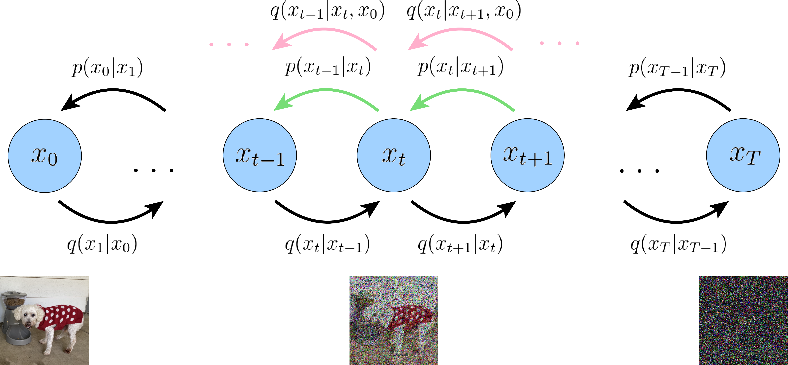

# [**Understanding Diffusion Models: A Unified Perspective**](../../README.md#table-of-contents)
---
---
---

# [*VDM*](../../README.md#table-of-contents)
---
---

[part 1으로 돌아가기](ch6_part1.md#vdm-elbo-유도-2---part-2에서-계속)

## **VDM ELBO 유도 2**

### **VDM ELBO 유도 1의 문제점**

VDM ELBO 유도 1에서 ELBO를 분해한 3개의 항으로 실제 학습을 할때는 ELBO의 3 항이 전부 기대값이므로 몬테카를로 근사를 사용한다.  
그러나 consistency term  
```math
\sum_{t=1}^{T-1}\mathbb{E}_{q(x_{t-1}, x_{t+1}|x_0)}\left[D_{\text{KL}}(q(x_{t}|x_{t-1}) \| p_{\theta}(x_{t}|x_{t+1}))\right]
```
을 보면 각 time-step $`t`$ 마다 $`{x_{t-1},\ x_{t+1}}`$ 2개의 변수로 기대값을 계산한다.  
단일 변수 1개만 있을 때의 1차원 공간 탐색보다 2변수 2차원 공간 탐색일 때 탐색해야 하는 공간이 넓어지므로 1차원과 비슷한 양의 샘플 개수를 뽑았을 경우, 1차원보다 모집단 추정이 잘 되지 않는다.  
따라서 매번 샘플 추출 및 계산을 할 때마다 모집단 추정값이 크게 달라지면서 분산이 높아진다. 이 높아진 분산이 $`\sum`$으로 보통 ~1000번 정도 중첩되므로 분산이 극단적으로 커지게 되고, 최종 손실 함수 기울기가 학습이 어려울 정도로 변화가 극심해진다. 결국, 경사하강법을 시행할 때마다 방향과 크기가 크게 달라지니 모델이 정상적으로 수렴하지 못할 가능성이 크다.

### **VDM ELBO 유도 2의 목표**
ELBO를 분해해서 나온 모든 항이 단일 변수 분포로 계산한 기대값이 되도록 한다.

### **Markov property를 이용한 트릭**

forward process에서 $`x_t`$에 대한 조건부확률분포 $`q(x_t | x_{0:t-1})`$을 계산할 때, Markov property로 인해 $`x_{t-1}`$만 조건에 남아 $`q(x_t | x_{t-1})`$이 된다. 이를 역으로 이용해 $`t`$ step 분포에 임의의 time-step $`x`$ 값을 조건에 추가해도 동일한 분포로 취급할 수 있으므로 $`x_0`$를 추가하면,

**Equation 46:**

```math
\begin{aligned}
q(x_t | x_{t-1}) = q(x_t | x_{t-1}, x_0) = \frac{q(x_{t-1}|x_t, x_0)q(x_t|x_0)}{q(x_{t-1}|x_0)}
\end{aligned}
```
<br>

로 표현이 가능하다. 이 Eq. 46을 이용해 다시 ELBO를 풀어보면

**Equation 47~58:**

```math
\begin{aligned}
\log p(x)
&\geq \mathbb{E}_{q(x_{1:T}|x_0)}\left[\log \frac{p(x_{0:T})}{q(x_{1:T}|x_0)}\right]\\
&= \mathbb{E}_{q(x_{1:T}|x_0)}\left[\log \frac{p(x_T)\prod_{t=1}^{T}p_{\boldsymbol{\theta}}(x_{t-1}|x_t)}{\prod_{t = 1}^{T}q(x_{t}|x_{t-1})}\right]\\
&= \mathbb{E}_{q(x_{1:T}|x_0)}\left[\log \frac{p(x_T)p_{\boldsymbol{\theta}}(x_0|x_1)\prod_{t=2}^{T}p_{\boldsymbol{\theta}}(x_{t-1}|x_t)}{q(x_1|x_0)\prod_{t = 2}^{T}q(x_{t}|x_{t-1})}\right]
\end{aligned}
```
```math
\begin{aligned}
&= \mathbb{E}_{q(x_{1:T}|x_0)}\left[\log \frac{p(x_T)p_{\boldsymbol{\theta}}(x_0|x_1)\prod_{t=2}^{T}p_{\boldsymbol{\theta}}(x_{t-1}|x_t)}{q(x_1|x_0)\prod_{t = 2}^{T}q(x_{t}|x_{t-1}, x_0)}\right] \qquad \text{(Markov property trick)}\\
&= \mathbb{E}_{q(x_{1:T}|x_0)}\left[\log \frac{p_{\boldsymbol{\theta}}(x_T)p_{\boldsymbol{\theta}}(x_0|x_1)}{q(x_1|x_0)} + \log \prod_{t=2}^{T}\frac{p_{\boldsymbol{\theta}}(x_{t-1}|x_t)}{q(x_{t}|x_{t-1}, x_0)}\right]
\end{aligned}
```
```math
\begin{aligned}
&= \mathbb{E}_{q(x_{1:T}|x_0)}\left[\log \frac{p(x_T)p_{\boldsymbol{\theta}}(x_0|x_1)}{q(x_1|x_0)} + \log \prod_{t=2}^{T}\frac{p_{\boldsymbol{\theta}}(x_{t-1}|x_t)}{\frac{q(x_{t-1}|x_{t}, x_0)q(x_t|x_0)}{q(x_{t-1}|x_0)}}\right] \qquad \text{(Eq. 46 대입)}\\
&= \mathbb{E}_{q(x_{1:T}|x_0)}\left[\log \frac{p(x_T)p_{\boldsymbol{\theta}}(x_0|x_1)}{q(x_1|x_0)} + \log \prod_{t=2}^{T}\frac{p_{\boldsymbol{\theta}}(x_{t-1}|x_t)}{\frac{q(x_{t-1}|x_{t}, x_0)\cancel{q(x_t|x_0)}}{\cancel{q(x_{t-1}|x_0)}}}\right]
\end{aligned}
```
```math
\begin{aligned}
&= \mathbb{E}_{q(x_{1:T}|x_0)}\left[\log \frac{p(x_T)p_{\boldsymbol{\theta}}(x_0|x_1)}{\cancel{q(x_1|x_0)}} + \log \frac{\cancel{q(x_1|x_0)}}{q(x_T|x_0)} + \log \prod_{t=2}^{T}\frac{p_{\boldsymbol{\theta}}(x_{t-1}|x_t)}{q(x_{t-1}|x_{t}, x_0)}\right]\\
&= \mathbb{E}_{q(x_{1:T}|x_0)}\left[\log \frac{p(x_T)p_{\boldsymbol{\theta}}(x_0|x_1)}{q(x_T|x_0)} +  \sum_{t=2}^{T}\log\frac{p_{\boldsymbol{\theta}}(x_{t-1}|x_t)}{q(x_{t-1}|x_{t}, x_0)}\right]
\end{aligned}
```
```math
\begin{aligned}
&= \mathbb{E}_{q(x_{1:T}|x_0)}\left[\log p_{\boldsymbol{\theta}}(x_0|x_1)\right] + \mathbb{E}_{q(x_{1:T}|x_0)}\left[\log \frac{p(x_T)}{q(x_T|x_0)}\right] + \sum_{t=2}^{T}\mathbb{E}_{q(x_{1:T}|x_0)}\left[\log\frac{p_{\boldsymbol{\theta}}(x_{t-1}|x_t)}{q(x_{t-1}|x_{t}, x_0)}\right]\\
&= \mathbb{E}_{q(x_{1}|x_0)}\left[\log p_{\boldsymbol{\theta}}(x_0|x_1)\right] + \mathbb{E}_{q(x_{T}|x_0)}\left[\log \frac{p(x_T)}{q(x_T|x_0)}\right] + \sum_{t=2}^{T}\mathbb{E}_{q(x_{t}, x_{t-1}|x_0)}\left[\log\frac{p_{\boldsymbol{\theta}}(x_{t-1}|x_t)}{q(x_{t-1}|x_{t}, x_0)}\right] \qquad \text{(Marginalization)}
\end{aligned}
```
```math
\begin{aligned}
&= \underbrace{\mathbb{E}_{q(x_{1}|x_0)}\left[\log p_{\boldsymbol{\theta}}(x_0|x_1)\right]}_\text{reconstruction term} - \underbrace{D_{\text{KL}}(q(x_T|x_0) \| p(x_T))}_\text{prior matching term} - \sum_{t=2}^{T} \underbrace{\mathbb{E}_{q(x_{t}|x_0)}\left[D_{\text{KL}}(q(x_{t-1}|x_t, x_0) \| p_{\boldsymbol{\theta}}(x_{t-1}|x_t))\right]}_\text{denoising matching term}
\end{aligned}
```
<br>

이 된다.

> **(Eq. 52 -> Eq. 54)**
>> ```math
>> \begin{aligned}
>>\prod_{t=2}^{T}\frac{p_{\boldsymbol{\theta}}(x_{t-1}|x_t)}{\frac{q(x_{t-1}|x_{t}, x_0)q(x_t|x_0)}{q(x_{t-1}|x_0)}}
>>&= \prod_{t=2}^{T}\frac{p_{\boldsymbol{\theta}}(x_{t-1}|x_t) q(x_{t-1}|x_0)}{q(x_{t-1}|x_{t}, x_0)q(x_t|x_0)}
>> \end{aligned}
>> ```
>> ```math
>> \begin{aligned}
>>&= \frac{p_{\boldsymbol{\theta}}(x_{1}|x_2)q(x_{1}|x_0)}{q(x_{1}|x_{2}, x_0)q(x_2|x_0)} \cdot \frac{p_{\boldsymbol{\theta}}(x_{2}|x_3)q(x_{2}|x_0)}{q(x_{2}|x_{3}, x_0)q(x_3|x_0)} \cdot \frac{p_{\boldsymbol{\theta}}(x_{3}|x_4)q(x_{3}|x_0)}{q(x_{3}|x_{4}, x_0)q(x_4|x_0)} \cdots \frac{p_{\boldsymbol{\theta}}(x_{T-1}|x_T)q(x_{T-1}|x_0)}{q(x_{T-1}|x_{T}, x_0)q(x_T|x_0)}
>> \end{aligned}
>> ```
>> ```math
>> \begin{aligned}
>>&= \frac{p_{\boldsymbol{\theta}}(x_{1}|x_2)q(x_{1}|x_0)}{q(x_{1}|x_{2}, x_0)\cancel{q(x_2|x_0)}} \cdot \frac{p_{\boldsymbol{\theta}}(x_{2}|x_3)\cancel{q(x_{2}|x_0)}}{q(x_{2}|x_{3}, x_0)\cancel{q(x_3|x_0)}} \cdot \frac{p_{\boldsymbol{\theta}}(x_{3}|x_4)\cancel{q(x_{3}|x_0)}}{q(x_{3}|x_{4}, x_0)\cancel{q(x_4|x_0)}} \cdots \frac{p_{\boldsymbol{\theta}}(x_{T-1}|x_T)\cancel{q(x_{T-1}|x_0)}}{q(x_{T-1}|x_{T}, x_0)q(x_T|x_0)}
>> \end{aligned}
>> ```
>> ```math
>> \begin{aligned}
>>&= \frac{q(x_{1}|x_0)}{q(x_T|x_0)} \prod_{t=2}^{T}\frac{p_{\boldsymbol{\theta}}(x_{t-1}|x_t)}{q(x_{t-1}|x_{t}, x_0)}
>> \end{aligned}
>> ```
<br>

> **(Eq. 57 -> Eq. 58)**
>> ```math
>> \begin{aligned}
>> \mathbb{E}_{q(x_{t}, x_{t-1}|x_0)}\left[\log\frac{p_{\boldsymbol{\theta}}(x_{t-1}|x_t)}{q(x_{t-1}|x_{t}, x_0)}\right]
>> &= \int \log\frac{p_{\boldsymbol{\theta}}(x_{t-1}|x_t)}{q(x_{t-1}|x_{t}, x_0)} q(x_{t}, x_{t-1}|x_0) dx_{t-1}dx_{t} \\
>> &= \int \log\frac{p_{\boldsymbol{\theta}}(x_{t-1}|x_t)}{q(x_{t-1}|x_{t}, x_0)} q(x_{t-1}|x_{t}, x_0) q(x_{t}|x_0) dx_{t-1}dx_{t} \\
>> &= \int \bigg(\int \log\frac{p_{\boldsymbol{\theta}}(x_{t-1}|x_t)}{q(x_{t-1}|x_{t}, x_0)} q(x_{t-1}|x_{t}, x_0)  dx_{t-1} \bigg) q(x_{t}|x_0) dx_{t} \\
>> &= - \int  D_{\text{KL}}(q(x_{t-1}|x_{t}, x_0) \| p_{\boldsymbol{\theta}}(x_{t-1}|x_t)) q(x_{t}|x_0) dx_{t} \\
>> &= - \mathbb{E}_{q(x_{t}|x_0)}\left[D_{\text{KL}}(q(x_{t-1}|x_{t}, x_0) \| p_{\boldsymbol{\theta}}(x_{t-1}|x_t))\right]
>> \end{aligned}
>> ```
<br>

### **VDM ELBO 유도 2 해석**

최종 3개 항을 확인해보면 다중 변수 기대값 계산이 없어, VDM ELBO 유도 1과 다르게 몬테카를로 추정 시에, 비교적 작은 분산을 가지고 진행이 가능하다.

**Reconstruction term**  
```math
\mathbb{E}_{q(x_{1}|x_0)}\left[\log p_{\boldsymbol{\theta}}(x_0|x_1)\right]
```
<br>

VAE ELBO의 reconstruction term과 동일한 구조로, 이 항 역시 몬테 카를로 추정을 이용해 근사 및 학습이 가능하다.

**Prior matching term**  
```math
D_{\text{KL}}(q(x_T|x_0) \| p(x_T))
```
<br>

VDM ELBO 유도 1의 prior matching term과 동일하게 학습하지 않는 항이며 제한조건 3을 만족하는 VDM에서는 사실상 0이다.

**Denoising matching term**  
```math
\mathbb{E}_{q(x_{t}|x_0)}\left[D_{\text{KL}}(q(x_{t-1}|x_t, x_0) \| p_{\boldsymbol{\theta}}(x_{t-1}|x_t))\right]
```
<br>

VDM 모델 $`p_{\boldsymbol{\theta}}(x_{t-1}|x_t)`$을 tractable(뒤에서 설명), ground-truth $`q(x_{t-1}|x_t, x_0)`$에 근사하도록 학습하는 항. ($`q(x_{t-1}|x_t, x_0)`$는 $`x_{t-1}`$을 $`x_t`$에 더해 최종 정답인 원본 이미지 $`x_0`$를 같이 참고해서 복원하는 분포이므로 ground-truth signal로 취급 가능)

이 VDM ELBO 2 해석을 그림으로 표현하면 아래와 같다.



[이미지 출처](https://arxiv.org/abs/2208.11970)

---

### **$`q(x_{t-1}|x_t, x_0)`$ == tractable**
---
[- part 3에서 계속](ch6_part3.md#-tractable)