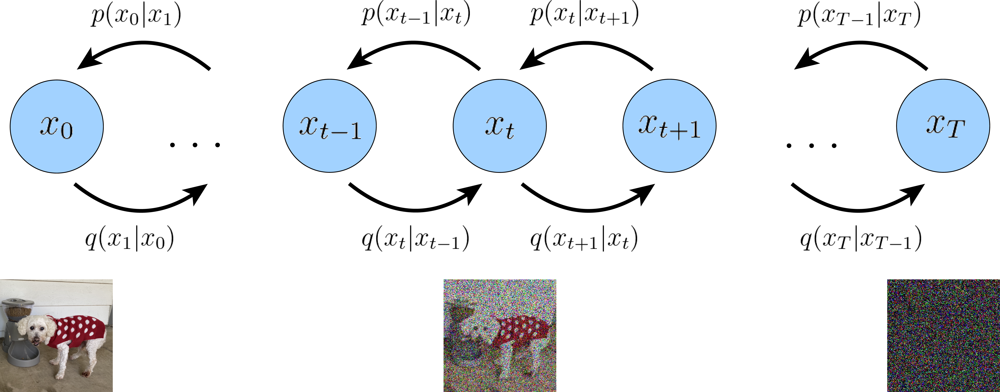
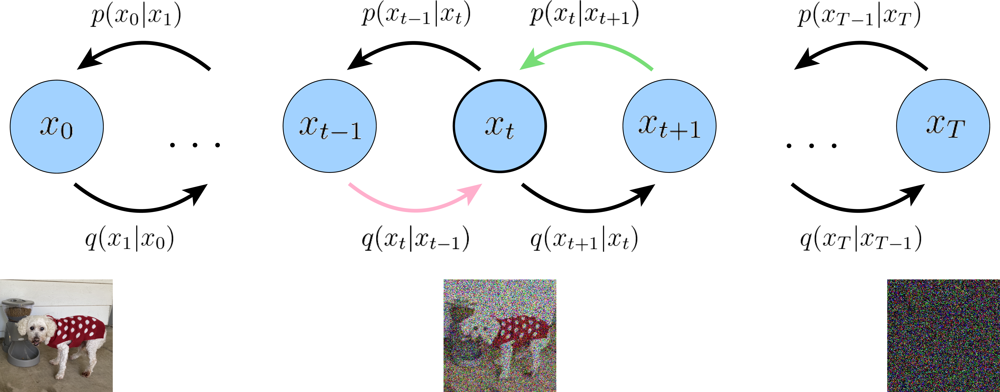

# [**Understanding Diffusion Models: A Unified Perspective**](../Table_of_contents.md#table-of-contents)
---
---
---

# [*VDM*](../Table_of_contents.md#table-of-contents)
---
---

## **Variational Diffusion Models**

> VDM = MHVAE + 3 restrictions

### *3 restrictions*
1. The latent dimension is exactly equal to the data dimension
2. The structure of the latent encoder at each timestep is not learned; it is pre-defined as a **linear** Gaussian
model. In other words, it is a Gaussian distribution centered around the output of the previous timestep
    - linear 조건이 반드시 있어야 한다. 
        - t-step의 $x_t$를 구하려 할 때, 비선형일 경우 0, 1, 2, ..., t 까지 순차적으로 복잡한 비선형 가우시안 분포 $q(x_i | x_{i-1})$를 계산해 다음 단계의 $x$를 계산해야 한다.  
        그러나 linearity를 가정하면 수많은 step 뒤의 $x_t$를 구하려 할 때도, 서로 독립인 가우시안 분포들의 선형 결합은 다시 가우시안 분포가 되기 때문에,  
        순차적으로 계산할 필요 없이 t-step의 $x_t$를 closed-form 계산으로 바로 구할 수 있다.  (자세한 수식은 뒤에) 
3. The Gaussian parameters of the latent encoders vary over time in such a way that the distribution of
the latent at final timestep T is a standard Gaussian

제한조건 1에서 관측데이터 $x$와 latent $z_{1:T}$들의 차원 수가 같으므로 time step $t \in [0,T]$에 대해, 관측데이터는 $t=0$일 때 $x_0$으로 두고, latent variables들은 $x_t,\ \text{where}\ t \in [1,T]$로 둘 수 있게 된다. 이 조건으로 인해 HVAE의 posterior Eq. 24가 VDM에서는 

**Equation 30:**  
$$q(x_{1:T}|x_0) = \prod_{t = 1}^{T}q(x_{t}|x_{t-1})$$

로 바뀌고,

> (HVAE와 다르게 encoder q에 $\phi$가 포함되어 있지 않다 => t에만 영향 받는 gaussian으로 모델링)

제한조건 2에서 forward(encoding) process의 각 단계 $q(x_{t}|x_{t-1})$가 신경망 모델이 아니라 미리 설정된 linear 가우시안으로 두므로, t단계의 encoder는

**Equation 31:**
```math
q(x_{t}|x_{t-1}) = \mathcal{N}(x_{t} ; \sqrt{\alpha_t} x_{t-1}, (1 - \alpha_t) \mathbf{I}
```
<br>

형태가 된다.

> 평균의 계수를 $\sqrt{\alpha_t}$, 분산의 계수를  $(1 - \alpha_t)$로 특이하게 두는 이유는, 각 단계의 분산이 1로 고정(variance-preserving)되기 때문.
> - 노이즈가 추가되는 각 단계에서 이전 단계의 그림 $x_{t-1}$을 그대로 두고 노이즈가 계속 추가되면 분산이 계속 증가하게 된다.
>   - $x_t$가 서로 독립인 $x_{t-1}$과 $\epsilon \sim \mathcal{N}(\mathbf{0}, \mathbf{I})$에 대해  $x_t = x_{t-1} + c\epsilon$의 형태이면 $x_{t-1}$과 $\epsilon$이 서로 독립이므로 분산의 성질 $V(aX + bY) = a^2V(X) + b^2V(Y)$을 적용해서 $x_t$의 분산을 구하면, $V(x_t) = V(x_{t-1}) + c^2 V(\epsilon) = V(x_{t-1}) + c^2$이 되서 양수가 계속 더해져서 분산이 증가하는 것을 확인 가능  
> - 논문과 동일하게 계수를 설정하면 분산이 1로 고정된다.
>   - $x_t = \sqrt{\alpha_t}x_{t-1} + \sqrt{1-\alpha_t}\epsilon$로 두면  
$V(x_t) = V(\sqrt{\alpha_t}x_{t-1}) + V(\sqrt{1-\alpha_t}\epsilon) = (\sqrt{\alpha_t})^2 V(x_{t-1}) + (\sqrt{1-\alpha_t})^2 V(\epsilon) = \alpha_t V(x_{t-1}) + (1-\alpha_t) V(\epsilon)$ 이 된다.  
$x_{t-1}$의 분산도 $\epsilon$과 동일하게 1이라면, $V(x_t) = \alpha_t (\mathbf{I}) + (1-\alpha_t) (\mathbf{I}) = (\alpha_t + 1 - \alpha_t) \mathbf{I} = \mathbf{I}$로 분산이 $\mathbf{I}$, 즉 1로 고정되는 것을 확인 가능  
>  
>  
>> 평균의 계수를 $\sqrt{\alpha_t}$, 분산의 계수를  $(1 - \alpha_t)$로 두어 Variance-Preserving을 설정하는 이유 
>> - 신경망 학습의 안정화
>>   - 딥러닝 모델은 입력값의 스케일이 일정할 때 가장 빠르고 안정적으로 학습한다. 스텝 $t$가 1이든 1,000이든 U-Net에 들어가는 이미지의 픽셀 분산이 항상 1 근처로 유지되므로, 모델이 극단적인 숫자에 압도되지 않는다.
>> - 목표 분포(Prior $x_T$)로의 정확한 수렴(제한 조건 3)
>>   - 디퓨전 모델의 forward process 최종 목표는 원본 이미지를 완벽한 순수 노이즈 $\mathcal{N}(\mathbf{0}, \mathbf{I})$로 만드는 것. 분산이 항상 $\mathbf{I}$로 묶여 있어야만 마지막 스텝에서 깔끔하게 표준 정규 분포에 도달 가능.
>> - 신호 대 잡음비(SNR)의 조절 
>>   - $\alpha_t$ 값은 시간이 지날수록 점점 작아지도록 설정한다. 즉, $\sqrt{\alpha_t}$(원본 신호의 비중)는 서서히 줄어들고 $\sqrt{1-\alpha_t}$(노이즈의 비중)는 서서히 커지게 된다($x_t = \sqrt{\alpha_t}x_{t-1} + \sqrt{1-\alpha_t}\epsilon$). 분산을 1로 유지하면서 데이터와 노이즈의 섞이는 비율을 조절할 수 있다.

제한 조건 3을 만족하도록 forward process를 설정하므로 $p(x_T)$가 표준 정규분포가 된다. 제한 조건1과 3을 이용하면 HVAE의 joint distribution Eq. 23가

**Equation 32, 33:**
```math
\begin{aligned}
p(x_{0:T}) &= p(x_T)\prod_{t=1}^{T}p_{\boldsymbol{\theta}}(x_{t-1}|x_t) \\
\text{where,} \\
p(x_T) &= \mathcal{N}(x_T; \mathbf{0}, \mathbf{I})
\end{aligned}
```
이 된다.

이 세가지 제한 조건을 만족하는 VDM을 이미지로 표현하면 아래와 같다.


[이미지 출처](https://arxiv.org/abs/2208.11970)

---

## **VDM ELBO 유도 1**


**Equation 34~45:**

```math
\begin{aligned}
\log p(x)
&= \log \int p(x_{0:T}) dx_{1:T}\\
&= \log \int \frac{p(x_{0:T})q(x_{1:T}|x_0)}{q(x_{1:T}|x_0)} dx_{1:T}\\
&= \log \mathbb{E}_{q(x_{1:T}|x_0)}\left[\frac{p(x_{0:T})}{q(x_{1:T}|x_0)}\right]\\
&\geq \mathbb{E}_{q(x_{1:T}|x_0)}\left[\log \frac{p(x_{0:T})}{q(x_{1:T}|x_0)}\right] \qquad \text{(Jensen's Inequality)} \\
&= \mathbb{E}_{q(x_{1:T}|x_0)}\left[\log \frac{p(x_T)\prod_{t=1}^{T}p_{\boldsymbol{\theta}}(x_{t-1}|x_t)}{\prod_{t = 1}^{T}q(x_{t}|x_{t-1})}\right] \qquad \text{(Eq. 30 and Eq. 32)}\\
&= \mathbb{E}_{q(x_{1:T}|x_0)}\left[\log \frac{p(x_T)p_{\boldsymbol{\theta}}(x_0|x_1)\prod_{t=2}^{T}p_{\boldsymbol{\theta}}(x_{t-1}|x_t)}{q(x_T|x_{T-1})\prod_{t = 1}^{T-1}q(x_{t}|x_{t-1})}\right]\\
&= \mathbb{E}_{q(x_{1:T}|x_0)}\left[\log \frac{p(x_T)p_{\boldsymbol{\theta}}(x_0|x_1)\prod_{t=1}^{T-1}p_{\boldsymbol{\theta}}(x_{t}|x_{t+1})}{q(x_T|x_{T-1})\prod_{t = 1}^{T-1}q(x_{t}|x_{t-1})}\right]\\
&= \mathbb{E}_{q(x_{1:T}|x_0)}\left[\log \frac{p(x_T)p_{\boldsymbol{\theta}}(x_0|x_1)}{q(x_T|x_{T-1})}\right] + \mathbb{E}_{q(x_{1:T}|x_0)}\left[\log \prod_{t = 1}^{T-1}\frac{p_{\boldsymbol{\theta}}(x_{t}|x_{t+1})}{q(x_{t}|x_{t-1})}\right]\\
&= \mathbb{E}_{q(x_{1:T}|x_0)}\left[\log p_{\boldsymbol{\theta}}(x_0|x_1)\right] + \mathbb{E}_{q(x_{1:T}|x_0)}\left[\log \frac{p(x_T)}{q(x_T|x_{T-1})}\right] + \mathbb{E}_{q(x_{1:T}|x_0)}\left[ \sum_{t=1}^{T-1} \log \frac{p_{\boldsymbol{\theta}}(x_{t}|x_{t+1})}{q(x_{t}|x_{t-1})}\right]\\
&= \mathbb{E}_{q(x_{1:T}|x_0)}\left[\log p_{\boldsymbol{\theta}}(x_0|x_1)\right] + \mathbb{E}_{q(x_{1:T}|x_0)}\left[\log \frac{p(x_T)}{q(x_T|x_{T-1})}\right] + \sum_{t=1}^{T-1}\mathbb{E}_{q(x_{1:T}|x_0)}\left[ \log \frac{p_{\boldsymbol{\theta}}(x_{t}|x_{t+1})}{q(x_{t}|x_{t-1})}\right]\\
&= \mathbb{E}_{q(x_{1}|x_0)}\left[\log p_{\boldsymbol{\theta}}(x_0|x_1)\right] + \mathbb{E}_{q(x_{T-1}, x_T|x_0)}\left[\log \frac{p(x_T)}{q(x_T|x_{T-1})}\right] + \sum_{t=1}^{T-1}\mathbb{E}_{q(x_{t-1}, x_t, x_{t+1}|x_0)}\left[\log \frac{p_{\boldsymbol{\theta}}(x_{t}|x_{t+1})}{q(x_{t}|x_{t-1})}\right]\\
&= \underbrace{\mathbb{E}_{q(x_{1}|x_0)}\left[\log p_{\theta}(x_0|x_1)\right]}_\text{reconstruction term} - \underbrace{\mathbb{E}_{q(x_{T-1}|x_0)}\left[D_{\text{KL}}(q(x_T|x_{T-1}) \| p(x_T))\right]}_\text{prior matching term} - \sum_{t=1}^{T-1}\underbrace{\mathbb{E}_{q(x_{t-1}, x_{t+1}|x_0)}\left[D_{\text{KL}}(q(x_{t}|x_{t-1}) \| p_{\theta}(x_{t}|x_{t+1}))\right]}_\text{consistency term}
\end{aligned}
```
<br>

> **(Eq. 43 -> Eq. 44)**
>> ```math
>> \begin{aligned}
>> \mathbb{E}_{q(x_{1:T}|x_0)}\left[\log p_{\boldsymbol{\theta}}(x_0|x_1)\right] 
>> &= \int \log p_{\boldsymbol{\theta}}(x_0|x_1)q(x_{1:T}|x_0)dx_{1:T} \\ 
>> &= \int \log p_{\boldsymbol{\theta}}(x_0|x_1)\bigg(\int q(x_{1:T}|x_0)dx_{2:T}\bigg) dx_{1} \\
>> &= \int \log p_{\boldsymbol{\theta}}(x_0|x_1)q(x_{1}|x_0) dx_{1} \qquad \text{(Marginalize}\ x_{2:T}\ \text{out)}\\
>> &= \mathbb{E}_{q(x_{1}|x_0)}\left[\log p_{\boldsymbol{\theta}}(x_0|x_1)\right]
>> \end{aligned}
>> ```
>
>> ```math
>> \begin{aligned}
>> \mathbb{E}_{q(x_{1:T}|x_0)}\left[\log \frac{p(x_T)}{q(x_T|x_{T-1})}\right] 
>> &= \int \log \frac{p(x_T)}{q(x_T|x_{T-1})} \bigg(\int q(x_{1:T}|x_0)dx_{1:T-2}\bigg)dx_{T-1}dx_{T} \\
>> &= \int \log \frac{p(x_T)}{q(x_T|x_{T-1})} q(x_{T-1}, x_{T}|x_0)dx_{T-1}dx_{T} \qquad \text{(Marginalize}\ x_{1:T-2}\ \text{out)}\\
>> &= \mathbb{E}_{q(x_{T-1}, x_{T}|x_0)}\left[\log \frac{p(x_T)}{q(x_T|x_{T-1})}\right] 
>> \end{aligned}
>> ```
> 
>> ```math
>> \begin{aligned}
>> \mathbb{E}_{q(x_{1:T}|x_0)}\left[ \log \frac{p_{\boldsymbol{\theta}}(x_{t}|x_{t+1})}{q(x_{t}|x_{t-1})}\right]
>> &= \int \log \frac{p_{\boldsymbol{\theta}}(x_{t}|x_{t+1})}{q(x_{t}|x_{t-1})} \bigg(\int q(x_{1:T}|x_0) dx_{1:t-2} dx_{t+2:T} \bigg) dx_{t-1}dx_{t} dx_{t+1} \\
>> & = \int \log \frac{p_{\boldsymbol{\theta}}(x_{t}|x_{t+1})}{q(x_{t}|x_{t-1})} q(x_{t-1}, x_{t}, x_{t+1}|x_0) dx_{t-1}dx_{t} dx_{t+1} \\
>> &= \mathbb{E}_{q(x_{t-1}, x_{t}, x_{t+1}|x_0)}\left[ \log \frac{p_{\boldsymbol{\theta}}(x_{t}|x_{t+1})}{q(x_{t}|x_{t-1})}\right]
>> \end{aligned}
>> ```
<br>

> **(Eq. 44 -> Eq. 45)**
>> ```math
>> \begin{aligned}
>> \mathbb{E}_{q(x_{T-1}, x_{T}|x_0)}\left[\log \frac{p(x_T)}{q(x_T|x_{T-1})}\right]
>> &= \int \log \frac{p(x_T)}{q(x_T|x_{T-1})} q(x_{T-1}, x_{T}|x_0) dx_{T-1}dx_{T} \\
>> &= \int \log \frac{p(x_T)}{q(x_T|x_{T-1})} q(x_{T}|x_{T-1}, x_0)q(x_{T-1}|x_0) dx_{T-1}dx_{T} \\
>> &= \int \log \frac{p(x_T)}{q(x_T|x_{T-1})} q(x_{T}|x_{T-1})q(x_{T-1}|x_0) dx_{T-1}dx_{T} \\
>> &\text{(} x_{T}\text{에 대한 조건부 확률은 Markov property로 인해 } x_{T-1}\text{를 제외한 나머지 조건은 있어도 없어도 똑같다.)}\\
>> &= \int \bigg( \int \log \frac{p(x_T)}{q(x_T|x_{T-1})} q(x_{T}|x_{T-1}) dx_{T} \bigg) q(x_{T-1}|x_0) dx_{T-1} \\
>> &= \int \bigg( \int - \log \frac{q(x_T|x_{T-1})}{p(x_T)} q(x_{T}|x_{T-1}) dx_{T} \bigg) q(x_{T-1}|x_0) dx_{T-1} \\
>> &= - \int D_{\text{KL}}(q(x_T|x_{T-1}) \| p(x_T)) q(x_{T-1}|x_0) dx_{T-1} \\
>> &= - \mathbb{E}_{q(x_{T-1}|x_0)}\left[D_{\text{KL}}(q(x_T|x_{T-1}) \| p(x_T))\right]
>> \end{aligned}
>> ```
>
>> ```math
>> \begin{aligned}
>> \mathbb{E}_{q(x_{t-1}, x_{t}, x_{t+1}|x_0)}\left[ \log \frac{p_{\boldsymbol{\theta}}(x_{t}|x_{t+1})}{q(x_{t}|x_{t-1})}\right]
>> &= \int \log \frac{p_{\boldsymbol{\theta}}(x_{t}|x_{t+1})}{q(x_{t}|x_{t-1})} q(x_{t-1}, x_{t}, x_{t+1}|x_0) dx_{t-1}dx_{t} dx_{t+1} \\
>> &= \int \log \frac{p_{\boldsymbol{\theta}}(x_{t}|x_{t+1})}{q(x_{t}|x_{t-1})} q(x_{t}|x_{t-1}, x_{t+1}, x_0)q(x_{t-1}, x_{t+1}|x_0) dx_{t-1}dx_{t} dx_{t+1} \\
>> &= \int \log \frac{p_{\boldsymbol{\theta}}(x_{t}|x_{t+1})}{q(x_{t}|x_{t-1})} q(x_{t}|x_{t-1})q(x_{t-1}, x_{t+1}|x_0) dx_{t-1}dx_{t} dx_{t+1} \\
>> &\text{(} x_{t}\text{에 대한 조건부 확률은 Markov property로 인해 } x_{t-1}\text{를 제외한 나머지 조건은 있어도 없어도 똑같다.)}\\
>> &= \int \bigg(\int \log \frac{p_{\boldsymbol{\theta}}(x_{t}|x_{t+1})}{q(x_{t}|x_{t-1})} q(x_{t}|x_{t-1}) dx_{t} \bigg) q(x_{t-1}, x_{t+1}|x_0) dx_{t-1}dx_{t+1} \\
>> &= \int \bigg(\int - \log \frac{q(x_{t}|x_{t-1})}{p_{\boldsymbol{\theta}}(x_{t}|x_{t+1})} q(x_{t}|x_{t-1}) dx_{t} \bigg) q(x_{t-1}, x_{t+1}|x_0) dx_{t-1}dx_{t+1} \\
>> &= - \int D_{\text{KL}}(q(x_{t}|x_{t-1}) \| p_{\boldsymbol{\theta}}(x_{t}|x_{t+1})) q(x_{t-1}, x_{t+1}|x_0) dx_{t-1}dx_{t+1} \\
>> &= - \mathbb{E}_{q(x_{t-1}, x_{t+1}|x_0)}\left[D_{\text{KL}}(q(x_{t}|x_{t-1}) \| p_{\theta}(x_{t}|x_{t+1}))\right]
>> \end{aligned}
>> ```
<br>

### **VDM ELBO 유도 1 해석**

**Reconstruction term** $\mathbb{E}_{q(x_{1}|x_0)}\left[\log p_{\boldsymbol{\theta}}(x_0|x_1)\right]$

VAE의 reconstruction term과 동일한 구조에 $x$와 $z$ 대신 원본 데이터 $x_0$와 first-step latent $x_1$로 교체된 형태 => 동일한 방식으로 학습

**Prior matching term** $\mathbb{E}_{q(x_{T-1}|x_0)}\left[D_{\text{KL}}(q(x_T|x_{T-1}) \| p(x_T))\right]$

이 항은 마지막 단계 T의 latent distribution $q(x_{T-1}, x_{T})$이 Gaussian prior에 근사할 때 최소화되는데, 학습 가능 파라메터가 없으므로 학습하지 않는 항이다. 학습은 하지 않지만 VDM 제한조건 3( = $p(x_T)$ 가 표준정규분포)을 만족하도록 충분히 T를 크게해서 forward process를 설계하므로 이 항은 사실상 0이다.

**consistency term** $\mathbb{E}_{q(x_{t-1}, x_{t+1}|x_0)}\left[D_{\text{KL}}(q(x_{t}|x_{t-1}) \| p_{\theta}(x_{t}|x_{t+1}))\right]$

이 항은 t step의 분포 ($x_t$의 분포)가 forward 방향에서 구하건, backward 방향에서 구하건 일관적으로 일치하게 하도록 강제하는 항이다. 이 항의 KL div.는 VDM 모델이 $x_{t+1}$에서 노이즈를 제거해 만든 $x_t$가 $x_{t-1}$에서 노이즈를 추가해 만든 $x_t$과 얼마나 비슷한지를 측정한다. 따라서 $p_{\theta}(x_{t}|x_{t+1})$를 사전에 설정한 linear Gaussian(Eq. 31)인 $q(x_{t}|x_{t-1})$를 근사하도록 학습해야 항이 최소화된다.

이 VDM ELBO 1 해석을 그림으로 표현하면 아래와 같다.



[이미지 출처](https://arxiv.org/abs/2208.11970)

---

## **VDM ELBO 유도 2**

### **VDM ELBO 유도 1의 문제점**

VDM ELBO 유도 1에서 ELBO를 분해한 3개의 항으로 실제 학습을 할때는 ELBO의 3 항이 전부 기대값이므로 몬테카를로 근사를 사용한다.  
그러나 consistency term $\sum_{t=1}^{T-1}\mathbb{E}_{q(x_{t-1}, x_{t+1}|x_0)}\left[D_{\text{KL}}(q(x_{t}|x_{t-1}) \| p_{\theta}(x_{t}|x_{t+1}))\right]$을 보면 각 time-step t 마다 ${x_{t-1}, x_{t+1}}$ 2개의 변수로 기대값을 계산한다.  
단일 변수 1개만 있을 때의 1차원 공간 탐색보다 2변수 2차원 공간 탐색일 때 탐색해야 하는 공간이 넓어지므로 1차원과 비슷한 양의 샘플 개수를 뽑았을 경우, 1차원보다 모집단 추정이 잘 되지 않는다.  
따라서 매번 샘플 추출 및 계산을 할 때마다 모집단 추정값이 크게 달라지면서 분산이 높아진다. 이 높아진 분산이 $\sum$으로 보통 ~1000번 정도 중첩되므로 분산이 극단적으로 커지게 되고, 최종 손실 함수 기울기가 학습이 어려울 정도로 변화가 극심해진다. 결국, 경사하강법을 시행할 때마다 방향과 크기가 크게 달라지니 모델이 정상적으로 수렴하지 못할 가능성이 크다.

### **VDM ELBO 유도 2의 목표**
ELBO를 분해해서 나온 모든 항이 단일 변수 분포로 계산한 기대값이 되도록 한다.

### **Markov property를 이용한 트릭**

forward process에서 $x_t$에 대한 조건부확률분포 $q(x_t | x_{0:t-1})$을 계산할 때, Markov property로 인해 $x_{t-1}$만 조건에 남아 $q(x_t | x_{t-1})$이 된다. 이를 역으로 이용해 t step 분포에 임의의 time-step $x$ 값을 조건에 추가해도 동일한 분포로 취급할 수 있으므로 $x_0$를 추가하면,

**Equation 46:**

```math
\begin{aligned}
q(x_t | x_{t-1}) = q(x_t | x_{t-1}, x_0) = \frac{q(x_{t-1}|x_t, x_0)q(x_t|x_0)}{q(x_{t-1}|x_0)}
\end{aligned}
```
<br>

로 표현이 가능하다. 이 Eq. 46을 이용해 다시 ELBO를 풀어보면

**Equation 47~58:**

```math
\begin{aligned}
\log p(x)
&\geq \mathbb{E}_{q(x_{1:T}|x_0)}\left[\log \frac{p(x_{0:T})}{q(x_{1:T}|x_0)}\right]\\
&= \mathbb{E}_{q(x_{1:T}|x_0)}\left[\log \frac{p(x_T)\prod_{t=1}^{T}p_{\boldsymbol{\theta}}(x_{t-1}|x_t)}{\prod_{t = 1}^{T}q(x_{t}|x_{t-1})}\right]\\
&= \mathbb{E}_{q(x_{1:T}|x_0)}\left[\log \frac{p(x_T)p_{\boldsymbol{\theta}}(x_0|x_1)\prod_{t=2}^{T}p_{\boldsymbol{\theta}}(x_{t-1}|x_t)}{q(x_1|x_0)\prod_{t = 2}^{T}q(x_{t}|x_{t-1})}\right]\\
&= \mathbb{E}_{q(x_{1:T}|x_0)}\left[\log \frac{p(x_T)p_{\boldsymbol{\theta}}(x_0|x_1)\prod_{t=2}^{T}p_{\boldsymbol{\theta}}(x_{t-1}|x_t)}{q(x_1|x_0)\prod_{t = 2}^{T}q(x_{t}|x_{t-1}, x_0)}\right] \qquad \text{(Markov property trick)}\\
&= \mathbb{E}_{q(x_{1:T}|x_0)}\left[\log \frac{p_{\boldsymbol{\theta}}(x_T)p_{\boldsymbol{\theta}}(x_0|x_1)}{q(x_1|x_0)} + \log \prod_{t=2}^{T}\frac{p_{\boldsymbol{\theta}}(x_{t-1}|x_t)}{q(x_{t}|x_{t-1}, x_0)}\right]\\
&= \mathbb{E}_{q(x_{1:T}|x_0)}\left[\log \frac{p(x_T)p_{\boldsymbol{\theta}}(x_0|x_1)}{q(x_1|x_0)} + \log \prod_{t=2}^{T}\frac{p_{\boldsymbol{\theta}}(x_{t-1}|x_t)}{\frac{q(x_{t-1}|x_{t}, x_0)q(x_t|x_0)}{q(x_{t-1}|x_0)}}\right] \qquad \text{(Eq. 46 대입)}\\
&= \mathbb{E}_{q(x_{1:T}|x_0)}\left[\log \frac{p(x_T)p_{\boldsymbol{\theta}}(x_0|x_1)}{q(x_1|x_0)} + \log \prod_{t=2}^{T}\frac{p_{\boldsymbol{\theta}}(x_{t-1}|x_t)}{\frac{q(x_{t-1}|x_{t}, x_0)\cancel{q(x_t|x_0)}}{\cancel{q(x_{t-1}|x_0)}}}\right]\\
&= \mathbb{E}_{q(x_{1:T}|x_0)}\left[\log \frac{p(x_T)p_{\boldsymbol{\theta}}(x_0|x_1)}{\cancel{q(x_1|x_0)}} + \log \frac{\cancel{q(x_1|x_0)}}{q(x_T|x_0)} + \log \prod_{t=2}^{T}\frac{p_{\boldsymbol{\theta}}(x_{t-1}|x_t)}{q(x_{t-1}|x_{t}, x_0)}\right]\\
&= \mathbb{E}_{q(x_{1:T}|x_0)}\left[\log \frac{p(x_T)p_{\boldsymbol{\theta}}(x_0|x_1)}{q(x_T|x_0)} +  \sum_{t=2}^{T}\log\frac{p_{\boldsymbol{\theta}}(x_{t-1}|x_t)}{q(x_{t-1}|x_{t}, x_0)}\right]\\
&= \mathbb{E}_{q(x_{1:T}|x_0)}\left[\log p_{\boldsymbol{\theta}}(x_0|x_1)\right] + \mathbb{E}_{q(x_{1:T}|x_0)}\left[\log \frac{p(x_T)}{q(x_T|x_0)}\right] + \sum_{t=2}^{T}\mathbb{E}_{q(x_{1:T}|x_0)}\left[\log\frac{p_{\boldsymbol{\theta}}(x_{t-1}|x_t)}{q(x_{t-1}|x_{t}, x_0)}\right]\\
&= \mathbb{E}_{q(x_{1}|x_0)}\left[\log p_{\boldsymbol{\theta}}(x_0|x_1)\right] + \mathbb{E}_{q(x_{T}|x_0)}\left[\log \frac{p(x_T)}{q(x_T|x_0)}\right] + \sum_{t=2}^{T}\mathbb{E}_{q(x_{t}, x_{t-1}|x_0)}\left[\log\frac{p_{\boldsymbol{\theta}}(x_{t-1}|x_t)}{q(x_{t-1}|x_{t}, x_0)}\right] \qquad \text{(Marginalization)}\\
&= \underbrace{\mathbb{E}_{q(x_{1}|x_0)}\left[\log p_{\boldsymbol{\theta}}(x_0|x_1)\right]}_\text{reconstruction term} - \underbrace{D_{\text{KL}}(q(x_T|x_0) \| p(x_T))}_\text{prior matching term} - \sum_{t=2}^{T} \underbrace{\mathbb{E}_{q(x_{t}|x_0)}\left[D_{\text{KL}}(q(x_{t-1}|x_t, x_0) \| p_{\boldsymbol{\theta}}(x_{t-1}|x_t))\right]}_\text{denoising matching term}
\end{aligned}
```
<br>

이 된다.

> **(Eq. 52 -> Eq. 54)**
>> ```math
>> \begin{aligned}
>>\prod_{t=2}^{T}\frac{p_{\boldsymbol{\theta}}(x_{t-1}|x_t)}{\frac{q(x_{t-1}|x_{t}, x_0)q(x_t|x_0)}{q(x_{t-1}|x_0)}}
>>&= \prod_{t=2}^{T}\frac{p_{\boldsymbol{\theta}}(x_{t-1}|x_t) q(x_{t-1}|x_0)}{q(x_{t-1}|x_{t}, x_0)q(x_t|x_0)} \\
>>&= \frac{p_{\boldsymbol{\theta}}(x_{1}|x_2)q(x_{1}|x_0)}{q(x_{1}|x_{2}, x_0)q(x_2|x_0)} \cdot \frac{p_{\boldsymbol{\theta}}(x_{2}|x_3)q(x_{2}|x_0)}{q(x_{2}|x_{3}, x_0)q(x_3|x_0)} \cdot \frac{p_{\boldsymbol{\theta}}(x_{3}|x_4)q(x_{3}|x_0)}{q(x_{3}|x_{4}, x_0)q(x_4|x_0)} \cdots \frac{p_{\boldsymbol{\theta}}(x_{T-1}|x_T)q(x_{T-1}|x_0)}{q(x_{T-1}|x_{T}, x_0)q(x_T|x_0)}\\
>>&= \frac{p_{\boldsymbol{\theta}}(x_{1}|x_2)q(x_{1}|x_0)}{q(x_{1}|x_{2}, x_0)\cancel{q(x_2|x_0)}} \cdot \frac{p_{\boldsymbol{\theta}}(x_{2}|x_3)\cancel{q(x_{2}|x_0)}}{q(x_{2}|x_{3}, x_0)\cancel{q(x_3|x_0)}} \cdot \frac{p_{\boldsymbol{\theta}}(x_{3}|x_4)\cancel{q(x_{3}|x_0)}}{q(x_{3}|x_{4}, x_0)\cancel{q(x_4|x_0)}} \cdots \frac{p_{\boldsymbol{\theta}}(x_{T-1}|x_T)\cancel{q(x_{T-1}|x_0)}}{q(x_{T-1}|x_{T}, x_0)q(x_T|x_0)}\\
>>&= \frac{q(x_{1}|x_0)}{q(x_T|x_0)} \prod_{t=2}^{T}\frac{p_{\boldsymbol{\theta}}(x_{t-1}|x_t)}{q(x_{t-1}|x_{t}, x_0)}
>> \end{aligned}
>> ```
<br>

> **(Eq. 57 -> Eq. 58)**
>> ```math
>> \begin{aligned}
>> \mathbb{E}_{q(x_{t}, x_{t-1}|x_0)}\left[\log\frac{p_{\boldsymbol{\theta}}(x_{t-1}|x_t)}{q(x_{t-1}|x_{t}, x_0)}\right]
>> &= \int \log\frac{p_{\boldsymbol{\theta}}(x_{t-1}|x_t)}{q(x_{t-1}|x_{t}, x_0)} q(x_{t}, x_{t-1}|x_0) dx_{t-1}dx_{t} \\
>> &= \int \log\frac{p_{\boldsymbol{\theta}}(x_{t-1}|x_t)}{q(x_{t-1}|x_{t}, x_0)} q(x_{t-1}|x_{t}, x_0) q(x_{t}|x_0) dx_{t-1}dx_{t} \\
>> &= \int \bigg(\int \log\frac{p_{\boldsymbol{\theta}}(x_{t-1}|x_t)}{q(x_{t-1}|x_{t}, x_0)} q(x_{t-1}|x_{t}, x_0)  dx_{t-1} \bigg) q(x_{t}|x_0) dx_{t} \\
>> &= - \int  D_{\text{KL}}(q(x_{t-1}|x_{t}, x_0) \| p_{\boldsymbol{\theta}}(x_{t-1}|x_t)) q(x_{t}|x_0) dx_{t} \\
>> &= - \mathbb{E}_{q(x_{t}|x_0)}\left[D_{\text{KL}}(q(x_{t-1}|x_{t}, x_0) \| p_{\boldsymbol{\theta}}(x_{t-1}|x_t))\right]
>> \end{aligned}
>> ```
<br>

### **VDM ELBO 유도 2 해석**

최종 3개 항을 확인해보면 다중 변수 기대값 계산이 없어, VDM ELBO 유도 1과 다르게 몬테카를로 추정 시에, 비교적 작은 분산을 가지고 진행이 가능하다.

**Reconstruction term** $\mathbb{E}_{q(x_{1}|x_0)}\left[\log p_{\boldsymbol{\theta}}(x_0|x_1)\right]$

VAE ELBO의 reconstruction term과 동일한 구조로, 이 항 역시 몬테 카를로 추정을 이용해 근사 및 학습이 가능하다.

**Prior matching term** $D_{\text{KL}}(q(x_T|x_0) \| p(x_T))$

VDM ELBO 유도 1의 prior matching term과 동일하게 학습하지 않는 항이며 제한조건 3을 만족하는 VDM에서는 사실상 0이다.

**Denoising matching term** $\mathbb{E}_{q(x_{t}|x_0)}\left[D_{\text{KL}}(q(x_{t-1}|x_t, x_0) \| p_{\boldsymbol{\theta}}(x_{t-1}|x_t))\right]$

VDM 모델 $p_{\boldsymbol{\theta}}(x_{t-1}|x_t)$을 tractable(뒤에서 설명), ground-truth $q(x_{t-1}|x_t, x_0)$에 근사하도록 학습하는 항. ($q(x_{t-1}|x_t, x_0)$는 $x_{t-1}$을 $x_t$에 더해 최종 정답인 원본 이미지 $x_0$를 같이 참고해서 복원하는 분포이므로 ground-truth signal로 취급 가능)

이 VDM ELBO 2 해석을 그림으로 표현하면 아래와 같다.


[이미지 출처](https://arxiv.org/abs/2208.11970)

### **$q(x_{t-1}|x_t, x_0)$ == tractable**

ELBO 유도 2의 3가지 항에서 학습을 진행할 때 가장 많은 비용이 들고 영향을 주는 부분은 summation이 있는 3번째 항. Markovian HVAE의 경우에는 forward process의 T개의 encoder $q_{\phi}$들을 decoder $p_{\theta}$와 같이 동시에 학습하며 $D_{\text{KL}}(q(x_{t-1}|x_t, x_0) \| p_{\boldsymbol{\theta}}(x_{t-1}|x_t))$을 최소화해야 하기 때문에 매우 어렵다. 반면에 VDM의 경우 제한조건에 의해서 encoder $q_{\phi}$들을 학습하지 않고, 미리 정해두므로 $q(x_{t-1}|x_t, x_0)$가 tractable이 된다.

Bayes rule을 이용하면 $q(x_{t-1}|x_t, x_0)$ 은

```math
q(x_{t-1}|x_t, x_0) = \frac{q(x_t | x_{t-1}, x_0)q(x_{t-1}|x_0)}{q(x_{t}|x_0)}
```
<br>

로 표현이 된다.  

> $q(x_{t-1}|x_t, x_0)$항은 $x_t$와 $x_0$이 주어졌을 때, 어떤 $x_{t-1}$이 가장 그럴듯한(잘복원된)지 알려주는 확률분포이고, Bayes rule을 적용한 우변에서 $q(x_t | x_{t-1}, x_0) = q(x_t | x_{t-1})$은 $x_{t-1}$에서 다시 $x_t$로 가는 것이 얼마나 쉬울까 알려주는 확률분포, $q(x_{t-1}|x_0)$은 주어진 $x_0$에서 $x_{t-1}$로 가는 것이 얼마나 쉬울까 알려주는 확률분포

분자의 첫번째 항 $q(x_t | x_{t-1}, x_0)$은 $q(x_t | x_{t-1}, x_0) = q(x_t | x_{t-1}) = \mathcal{N}(x_{t} ; \sqrt{\alpha_t} x_{t-1}, (1 - \alpha_t)\mathbf{I})$ 이므로 tractable (Markov property + Eq. 31)  

분자의 두번째 항 $q(x_{t-1}|x_0)$과 분모 $q(x_{t}|x_0)$도 제한조건에 의해 VDM의 encoder transitions가 linear라는 점 때문에 tractable이다.  
이를 보이기 위해 이미 알고 있는 $q(x_t | x_{t-1}) = \mathcal{N}(x_{t} ; \sqrt{\alpha_t} x_{t-1}, (1 - \alpha_t)\mathbf{I})$에 reparameterization trick을 적용해 $x_t$, $x_{t-1}$를 표현하면,

**Equation 59:**
```math
\begin{aligned}
x_t = \sqrt{\alpha_t}x_{t-1} + \sqrt{1 - \alpha_t}\boldsymbol{\epsilon} \quad \text{with } \boldsymbol{\epsilon} \sim \mathcal{N}(\boldsymbol{\epsilon}; \mathbf{0}, \mathbf{I})
\end{aligned}
```
<br>

> ```math
> x_t\text{ 가 전단계 }x_{t-1}\text{와 노이즈의 단순한 선형결합}
> ```

**Equation 60:**

```math
\begin{aligned}
x_{t-1} = \sqrt{\alpha_{t-1}}x_{t-2} + \sqrt{1 - \alpha_{t-1}}\boldsymbol{\epsilon} \quad \text{with } \boldsymbol{\epsilon} \sim \mathcal{N}(\boldsymbol{\epsilon}; \mathbf{0}, \mathbf{I})
\end{aligned}
```
<br>

이 된다.  
2T개의 독립적인 랜덤 노이즈 변수 $\{\bm{\epsilon}^*_t, \bm{\epsilon}_t\}^T_{t=0} \overset{iid}{\sim} \mathcal{N}(\bm{\epsilon}; \bm{0},\textbf{I})$가 있고, 그 랜덤 노이즈 변수들에서 샘플링이 가능하다고 가정한 상태에서, 아래와 같이 reparameterization trick으로 표현한 t-1, t-2, ...., 1 단계의 $x_i$들을 계속 대입하면 $x_t \sim q(x_t | x_0)$을 하나의 가우시안 분포로 표현 가능하다.

**Equation 61~70:**

```math
\begin{aligned}
x_t  &= \sqrt{\alpha_t}x_{t-1} + \sqrt{1 - \alpha_t}\boldsymbol{\epsilon}_{t-1}^*\\
&= \sqrt{\alpha_t}\left(\sqrt{\alpha_{t-1}}x_{t-2} + \sqrt{1 - \alpha_{t-1}}\boldsymbol{\epsilon}_{t-2}^*\right) + \sqrt{1 - \alpha_t}\boldsymbol{\epsilon}_{t-1}^*\\
&= \sqrt{\alpha_t\alpha_{t-1}}x_{t-2} + \sqrt{\alpha_t - \alpha_t\alpha_{t-1}}\boldsymbol{\epsilon}_{t-2}^* + \sqrt{1 - \alpha_t}\boldsymbol{\epsilon}_{t-1}^*\\
&= \sqrt{\alpha_t\alpha_{t-1}}x_{t-2} + \sqrt{\sqrt{\alpha_t - \alpha_t\alpha_{t-1}}^2 + \sqrt{1 - \alpha_t}^2}\boldsymbol{\epsilon}_{t-2} \\
&= \sqrt{\alpha_t\alpha_{t-1}}x_{t-2} + \sqrt{\alpha_t - \alpha_t\alpha_{t-1} + 1 - \alpha_t}\boldsymbol{\epsilon}_{t-2}\\
&= \sqrt{\alpha_t\alpha_{t-1}}x_{t-2} + \sqrt{1 - \alpha_t\alpha_{t-1}}\boldsymbol{\epsilon}_{t-2} \\
&= \ldots\\
&= \sqrt{\prod_{i=1}^t\alpha_i}x_0 + \sqrt{1 - \prod_{i=1}^t\alpha_i}\boldsymbol{\epsilon}_0\\
&= \sqrt{\bar\alpha_t}x_0 + \sqrt{1 - \bar\alpha_t}\boldsymbol{\epsilon}_0 \qquad \bigg(\prod_{i=1}^t\alpha_i \stackrel{\text{def}}{=} \bar\alpha_t \bigg) \\
&\sim \mathcal{N}(x_{t} ; \sqrt{\bar\alpha_t}x_0, \left(1 - \bar\alpha_t\right)\mathbf{I}) 
\end{aligned}
```
<br>

> **(Eq. 63 -> Eq. 66)**
>> $\sqrt{\alpha_t - \alpha_t\alpha_{t-1}}\boldsymbol{\epsilon}_{t-2}^* + \sqrt{1 - \alpha_t}\boldsymbol{\epsilon}_{t-1}^*$은 서로 독립인 Gaussian의 합이므로 합 결과도 또 Gaussian이 된다.  
>> 이 때, 합 분포의 평균과 분산은 두 Gaussian 분포의 평균, 분산의 합이 된다.   
>> $\sqrt{\alpha_t - \alpha_t\alpha_{t-1}}\boldsymbol{\epsilon}_{t-2}^*$의 평균은 $0$, 분산은 $(\sqrt{\alpha_t - \alpha_t\alpha_{t-1}})^2$,  
>> $\sqrt{1 - \alpha_t}\boldsymbol{\epsilon}_{t-1}^*$의 평균은 $0$, 분산은 $(\sqrt{1 - \alpha_t})^2$ 이므로  
>> 합분포의 평균은 $0 + 0 = 0$, 분산은 $(\sqrt{\alpha_t - \alpha_t\alpha_{t-1}})^2 + (\sqrt{1 - \alpha_t})^2 = \alpha_t - \alpha_t\alpha_{t-1} + 1 - \alpha_t = 1 - \alpha_t\alpha_{t-1}$가 된다.  
>> 이를 reparameterization trick을 이용해 노이즈 $\bm{\epsilon}$ 형태로 표현하면 Eq. 66의 $\sqrt{1 - \alpha_t\alpha_{t-1}}\boldsymbol{\epsilon}_{t-2}$을 얻을 수 있다.

이제 $q(x_{t-1}|x_t, x_0) = \frac{q(x_t | x_{t-1}, x_0)q(x_{t-1}|x_0)}{q(x_{t}|x_0)}$의 우변이 모두 tractable이므로 이들을 대입하면

**Equation 71~84:**

```math
\begin{aligned}
q(x_{t-1}|x_t, x_0)
&= \frac{q(x_t | x_{t-1}, x_0)q(x_{t-1}|x_0)}{q(x_{t}|x_0)}\\
&= \frac{\mathcal{N}(x_{t} ; \sqrt{\alpha_t} x_{t-1}, (1 - \alpha_t)\mathbf{I})\mathcal{N}(x_{t-1} ; \sqrt{\bar\alpha_{t-1}}x_0, (1 - \bar\alpha_{t-1}) \mathbf{I})}{\mathcal{N}(x_{t} ; \sqrt{\bar\alpha_{t}}x_0, (1 - \bar\alpha_{t})\mathbf{I})}\\
&\propto \text{exp}\left\{-\left[\frac{(x_{t} - \sqrt{\alpha_t} x_{t-1})^2}{2(1 - \alpha_t)} + \frac{(x_{t-1} - \sqrt{\bar\alpha_{t-1}} x_0)^2}{2(1 - \bar\alpha_{t-1})} - \frac{(x_{t} - \sqrt{\bar\alpha_t} x_{0})^2}{2(1 - \bar\alpha_t)} \right]\right\}\\
&= \text{exp}\left\{-\frac{1}{2}\left[\frac{(x_{t} - \sqrt{\alpha_t} x_{t-1})^2}{1 - \alpha_t} + \frac{(x_{t-1} - \sqrt{\bar\alpha_{t-1}} x_0)^2}{1 - \bar\alpha_{t-1}} - \frac{(x_{t} - \sqrt{\bar\alpha_t} x_{0})^2}{1 - \bar\alpha_t} \right]\right\}\\
&= \text{exp}\left\{-\frac{1}{2}\left[\frac{(-2\sqrt{\alpha_t} x_{t}x_{t-1} + \alpha_t x_{t-1}^2)}{1 - \alpha_t} + \frac{(x_{t-1}^2 - 2\sqrt{\bar\alpha_{t-1}}x_{t-1} x_0)}{1 - \bar\alpha_{t-1}} + C(x_t, x_0)\right]\right\} \\
&\propto \text{exp}\left\{-\frac{1}{2}\left[- \frac{2\sqrt{\alpha_t} x_{t}x_{t-1}}{1 - \alpha_t} + \frac{\alpha_t x_{t-1}^2}{1 - \alpha_t} + \frac{x_{t-1}^2}{1 - \bar\alpha_{t-1}} - \frac{2\sqrt{\bar\alpha_{t-1}}x_{t-1} x_0}{1 - \bar\alpha_{t-1}}\right]\right\}\\
&= \text{exp}\left\{-\frac{1}{2}\left[(\frac{\alpha_t}{1 - \alpha_t} + \frac{1}{1 - \bar\alpha_{t-1}})x_{t-1}^2 - 2\left(\frac{\sqrt{\alpha_t}x_{t}}{1 - \alpha_t} + \frac{\sqrt{\bar\alpha_{t-1}}x_0}{1 - \bar\alpha_{t-1}}\right)x_{t-1}\right]\right\}\\
&= \text{exp}\left\{-\frac{1}{2}\left[\frac{\alpha_t(1-\bar\alpha_{t-1}) + 1 - \alpha_t}{(1 - \alpha_t)(1 - \bar\alpha_{t-1})}x_{t-1}^2 - 2\left(\frac{\sqrt{\alpha_t}x_{t}}{1 - \alpha_t} + \frac{\sqrt{\bar\alpha_{t-1}}x_0}{1 - \bar\alpha_{t-1}}\right)x_{t-1}\right]\right\}\\
&= \text{exp}\left\{-\frac{1}{2}\left[\frac{\alpha_t-\bar\alpha_{t} + 1 - \alpha_t}{(1 - \alpha_t)(1 - \bar\alpha_{t-1})}x_{t-1}^2 - 2\left(\frac{\sqrt{\alpha_t}x_{t}}{1 - \alpha_t} + \frac{\sqrt{\bar\alpha_{t-1}}x_0}{1 - \bar\alpha_{t-1}}\right)x_{t-1}\right]\right\}\\
&= \text{exp}\left\{-\frac{1}{2}\left[\frac{1 -\bar\alpha_{t}}{(1 - \alpha_t)(1 - \bar\alpha_{t-1})}x_{t-1}^2 - 2\left(\frac{\sqrt{\alpha_t}x_{t}}{1 - \alpha_t} + \frac{\sqrt{\bar\alpha_{t-1}}x_0}{1 - \bar\alpha_{t-1}}\right)x_{t-1}\right]\right\}\\
&= \text{exp}\left\{-\frac{1}{2}\left(\frac{1 -\bar\alpha_{t}}{(1 - \alpha_t)(1 - \bar\alpha_{t-1})}\right)\left[x_{t-1}^2 - 2\frac{\left(\frac{\sqrt{\alpha_t}x_{t}}{1 - \alpha_t} + \frac{\sqrt{\bar\alpha_{t-1}}x_0}{1 - \bar\alpha_{t-1}}\right)}{\frac{1 -\bar\alpha_{t}}{(1 - \alpha_t)(1 - \bar\alpha_{t-1})}}x_{t-1}\right]\right\}\\
&= \text{exp}\left\{-\frac{1}{2}\left(\frac{1 -\bar\alpha_{t}}{(1 - \alpha_t)(1 - \bar\alpha_{t-1})}\right)\left[x_{t-1}^2 - 2\frac{\left(\frac{\sqrt{\alpha_t}x_{t}}{1 - \alpha_t} + \frac{\sqrt{\bar\alpha_{t-1}}x_0}{1 - \bar\alpha_{t-1}}\right)(1 - \alpha_t)(1 - \bar\alpha_{t-1})}{1 -\bar\alpha_{t}}x_{t-1}\right]\right\}\\
&= \text{exp}\left\{-\frac{1}{2}\left(\frac{1}{\frac{(1 - \alpha_t)(1 - \bar\alpha_{t-1})}{1 -\bar\alpha_{t}}}\right)\left[x_{t-1}^2 - 2\frac{\sqrt{\alpha_t}(1-\bar\alpha_{t-1})x_{t} + \sqrt{\bar\alpha_{t-1}}(1-\alpha_t)x_0}{1 -\bar\alpha_{t}}x_{t-1}\right]\right\}\\
&\propto \mathcal{N}\left(x_{t-1} ; \underbrace{\frac{\sqrt{\alpha_t}(1-\bar\alpha_{t-1})x_{t} + \sqrt{\bar\alpha_{t-1}}(1-\alpha_t)x_0}{1 -\bar\alpha_{t}}}_{\boldsymbol{\mu}_q(x_t, x_0)}, \underbrace{\frac{(1 - \alpha_t)(1 - \bar\alpha_{t-1})}{1 -\bar\alpha_{t}}\mathbf{I}}_{\boldsymbol{\Sigma}_q(t)}\right)
\end{aligned}
```
<br>

이 결과를 보면, $q(x_{t-1}|x_t, x_0)$은 평균이 $\boldsymbol{\mu}_q(x_t, x_0)$이고 분산이 $\boldsymbol{\Sigma}_q(t)$인 Gaussian 분포이므로 tractable함을 알 수 있다.

> 사실 식에 나오는 모든 가우시안 분포들은 다변수 가우시안 분포이므로 지수항은 $-\frac{1}{2}(\mathbf{x}-\bm{\mu})^T\Sigma^{-1}(\mathbf{x}-\bm{\mu})$로 $-\frac{1}{2} \times \text{Mahalanobis distance}(\mathbf{x},\bm{\mu})$이다.  
> 또 모든 분포가 등방성(isotropic, 공분산이 $\mathbf{I}$의 상수배) 이므로 $\Sigma = \sigma^2\mathbf{I} \rightarrow \Sigma^{-1} = \frac{1}{\sigma^2}\mathbf{I}$이 되어  
> 지수항은 $-\frac{1}{2\sigma^2}\|\mathbf{x}-\bm{\mu}\|^2$ 이 된다.  
> 이를 반영해 다시 계산해보면
> ```math
> \begin{aligned}
>q(\mathbf{x}_{t-1}|\mathbf{x}_t, \mathbf{x}_0)
>&= \frac{q(\mathbf{x}_t | \mathbf{x}_{t-1}, \mathbf{x}_0)q(\mathbf{x}_{t-1}|\mathbf{x}_0)}{q(\mathbf{x}_{t}|\mathbf{x}_0)}\\
>&= \frac{\mathcal{N}(\mathbf{x}_{t} ; \sqrt{\alpha_t} \mathbf{x}_{t-1}, (1 - \alpha_t)\mathbf{I})\mathcal{N}(\mathbf{x}_{t-1} ; \sqrt{\bar\alpha_{t-1}}\mathbf{x}_0, (1 - \bar\alpha_{t-1}) \mathbf{I})}{\mathcal{N}(\mathbf{x}_{t} ; \sqrt{\bar\alpha_{t}}\mathbf{x}_0, (1 - \bar\alpha_{t})\mathbf{I})}\\
>&\propto \text{exp}\left\{-\left[\frac{\|\mathbf{x}_{t} - \sqrt{\alpha_t} \mathbf{x}_{t-1}\|^2}{2(1 - \alpha_t)} + \frac{\|\mathbf{x}_{t-1} - \sqrt{\bar\alpha_{t-1}} \mathbf{x}_0\|^2}{2(1 - \bar\alpha_{t-1})} - \frac{\|\mathbf{x}_{t} - \sqrt{\bar\alpha_t} \mathbf{x}_{0}\|^2}{2(1 - \bar\alpha_t)} \right]\right\}\\
>&= \text{exp}\left\{-\frac{1}{2}\left[\frac{\|\mathbf{x}_{t} - \sqrt{\alpha_t} \mathbf{x}_{t-1}\|^2}{1 - \alpha_t} + \frac{\|\mathbf{x}_{t-1} - \sqrt{\bar\alpha_{t-1}} \mathbf{x}_0\|^2}{1 - \bar\alpha_{t-1}} - \frac{\|\mathbf{x}_{t} - \sqrt{\bar\alpha_t} \mathbf{x}_{0}\|^2}{1 - \bar\alpha_t} \right]\right\}\\
>&= \text{exp}\left\{-\frac{1}{2}\left[\frac{\sum_i(x_{t}^i - \sqrt{\alpha_t} x_{t-1}^i)^2}{1 - \alpha_t} + \frac{\sum_i(x_{t-1}^i - \sqrt{\bar\alpha_{t-1}} x_0^i)^2}{1 - \bar\alpha_{t-1}} - \frac{\sum_i(x_{t}^i - \sqrt{\bar\alpha_t} x_{0}^i)^2}{1 - \bar\alpha_t} \right]\right\}\\
>&= \text{exp}\left\{-\frac{1}{2}\left[\frac{\sum_i((x_{t}^i)^2 - 2\sqrt{\alpha_t} x_{t}^i x_{t-1}^i + \alpha_t(x_{t-1}^i)^2)}{1 - \alpha_t} + \frac{\sum_i((x_{t-1}^i)^2 - 2 \sqrt{\bar\alpha_{t-1}} x_{t-1}^i x_0^i + \bar\alpha_{t-1}(x_0^i)^2)}{1 - \bar\alpha_{t-1}} - \frac{\sum_i(x_{t}^i - \sqrt{\bar\alpha_t} x_{0}^i)^2}{1 - \bar\alpha_t} \right]\right\}\\
>& \text{(} \mathbf{x}_{t-1} \text{에 대한 분포이므로 나머지는 상수 취급)} \\
>&= \text{exp}\left\{-\frac{1}{2}\left[\sum_i\bigg(\frac{(-2\sqrt{\alpha_t} x_{t}^ix_{t-1}^i + \alpha_t (x_{t-1}^i)^2)}{1 - \alpha_t} + \frac{((x_{t-1}^i)^2 - 2\sqrt{\bar\alpha_{t-1}}x_{t-1}^i x_0^i)}{1 - \bar\alpha_{t-1}} + C(x_t^i, x_0^i)\bigg)\right]\right\} \\
>&\propto \text{exp}\left\{-\frac{1}{2}\left[\sum_i \bigg(- \frac{2\sqrt{\alpha_t} x_{t}^ix_{t-1}^i}{1 - \alpha_t} + \frac{\alpha_t (x_{t-1}^i)^2}{1 - \alpha_t} + \frac{(x_{t-1}^i)^2}{1 - \bar\alpha_{t-1}} - \frac{2\sqrt{\bar\alpha_{t-1}}x_{t-1}^i x_0^i}{1 - \bar\alpha_{t-1}}\bigg)\right]\right\}\\
>&= \text{exp}\left\{-\frac{1}{2}\left[\sum_i\bigg((\frac{\alpha_t}{1 - \alpha_t} + \frac{1}{1 - \bar\alpha_{t-1}})(x_{t-1}^i)^2 - 2\left(\frac{\sqrt{\alpha_t}x_{t}^i}{1 - \alpha_t} + \frac{\sqrt{\bar\alpha_{t-1}}x_0^i}{1 - \bar\alpha_{t-1}}\right)x_{t-1}^i\bigg)\right]\right\}\\
>&= \text{exp}\left\{-\frac{1}{2}\left[\sum_i\bigg(\frac{\alpha_t(1-\bar\alpha_{t-1}) + 1 - \alpha_t}{(1 - \alpha_t)(1 - \bar\alpha_{t-1})}(x_{t-1}^i)^2 - 2\left(\frac{\sqrt{\alpha_t}x_{t}^i}{1 - \alpha_t} + \frac{\sqrt{\bar\alpha_{t-1}}x_0^i}{1 - \bar\alpha_{t-1}}\right)x_{t-1}^i\bigg)\right]\right\}\\
>&= \text{exp}\left\{-\frac{1}{2}\left[\sum_i\bigg(\frac{\alpha_t-\bar\alpha_{t} + 1 - \alpha_t}{(1 - \alpha_t)(1 - \bar\alpha_{t-1})}(x_{t-1}^i)^2 - 2\left(\frac{\sqrt{\alpha_t}x_{t}^i}{1 - \alpha_t} + \frac{\sqrt{\bar\alpha_{t-1}}x_0^i}{1 - \bar\alpha_{t-1}}\right)x_{t-1}^i\bigg)\right]\right\}\\
>&= \text{exp}\left\{-\frac{1}{2}\left[\sum_i\bigg(\frac{1 -\bar\alpha_{t}}{(1 - \alpha_t)(1 - \bar\alpha_{t-1})}(x_{t-1}^i)^2 - 2\left(\frac{\sqrt{\alpha_t}x_{t}^i}{1 - \alpha_t} + \frac{\sqrt{\bar\alpha_{t-1}}x_0^i}{1 - \bar\alpha_{t-1}}\right)x_{t-1}^i\bigg)\right]\right\}\\
>&= \text{exp}\left\{-\frac{1}{2}\left(\frac{1 -\bar\alpha_{t}}{(1 - \alpha_t)(1 - \bar\alpha_{t-1})}\right)\left[\sum_i \bigg( (x_{t-1}^i)^2 - 2\frac{\left(\frac{\sqrt{\alpha_t}x_{t}^i}{1 - \alpha_t} + \frac{\sqrt{\bar\alpha_{t-1}}x_0^i}{1 - \bar\alpha_{t-1}}\right)}{\frac{1 -\bar\alpha_{t}}{(1 - \alpha_t)(1 - \bar\alpha_{t-1})}}x_{t-1}^i \bigg)\right]\right\}\\
>&= \text{exp}\left\{-\frac{1}{2}\left(\frac{1 -\bar\alpha_{t}}{(1 - \alpha_t)(1 - \bar\alpha_{t-1})}\right)\left[\sum_i \bigg( (x_{t-1}^i)^2 - 2\frac{\left(\frac{\sqrt{\alpha_t}x_{t}^i}{1 - \alpha_t} + \frac{\sqrt{\bar\alpha_{t-1}}x_0^i}{1 - \bar\alpha_{t-1}}\right)(1 - \alpha_t)(1 - \bar\alpha_{t-1})}{1 -\bar\alpha_{t}}x_{t-1}^i\bigg)\right]\right\}\\
>&= \text{exp}\left\{-\frac{1}{2}\left(\frac{1}{\frac{(1 - \alpha_t)(1 - \bar\alpha_{t-1})}{1 -\bar\alpha_{t}}}\right)\left[\sum_i\bigg((x_{t-1}^i)^2 - 2\frac{\sqrt{\alpha_t}(1-\bar\alpha_{t-1})x_{t}^i + \sqrt{\bar\alpha_{t-1}}(1-\alpha_t)x_0^i}{1 -\bar\alpha_{t}}x_{t-1}^i\bigg)\right]\right\}\\
>& \bigg(\big(\frac{\sqrt{\alpha_t}(1-\bar\alpha_{t-1})x_{t}^i + \sqrt{\bar\alpha_{t-1}}(1-\alpha_t)x_0^i}{1 -\bar\alpha_{t}}\big) = K \text{로 두면}\bigg) \\
>&= \text{exp}\left\{-\frac{1}{2}\left(\frac{1}{\frac{(1 - \alpha_t)(1 - \bar\alpha_{t-1})}{1 -\bar\alpha_{t}}}\right)\left[\sum_i\bigg((x_{t-1}^i)^2 - 2Kx_{t-1}^i + K^2 - K^2 \bigg)\right]\right\}\\
>&\propto \text{exp}\left\{-\frac{1}{2}\left(\frac{1}{\frac{(1 - \alpha_t)(1 - \bar\alpha_{t-1})}{1 -\bar\alpha_{t}}}\right)\left[\sum_i\bigg((x_{t-1}^i - K)^2 \bigg)\right]\right\}\\
>&= \text{exp}\left\{-\frac{1}{2}\left(\frac{1}{\frac{(1 - \alpha_t)(1 - \bar\alpha_{t-1})}{1 -\bar\alpha_{t}}}\right)\left[\sum_i\bigg(\Big(x_{t-1}^i - \big(\frac{\sqrt{\alpha_t}(1-\bar\alpha_{t-1})x_{t}^i + \sqrt{\bar\alpha_{t-1}}(1-\alpha_t)x_0^i}{1 -\bar\alpha_{t}}\big)\Big)^2 \bigg)\right]\right\}\\
>&= \text{exp}\left\{-\frac{1}{2}\left(\frac{1}{\frac{(1 - \alpha_t)(1 - \bar\alpha_{t-1})}{1 -\bar\alpha_{t}}}\right)\|\mathbf{x}_{t-1} - \big(\frac{\sqrt{\alpha_t}(1-\bar\alpha_{t-1})\mathbf{x}_{t} + \sqrt{\bar\alpha_{t-1}}(1-\alpha_t)\mathbf{x}_0}{1 -\bar\alpha_{t}}\big)\|^2 \right\}\\
>&\propto \mathcal{N}\left(\mathbf{x}_{t-1} ; \underbrace{\frac{\sqrt{\alpha_t}(1-\bar\alpha_{t-1})\mathbf{x}_{t} + \sqrt{\bar\alpha_{t-1}}(1-\alpha_t)\mathbf{x}_0}{1 -\bar\alpha_{t}}}_{\boldsymbol{\mu}_q(\mathbf{x}_t, \mathbf{x}_0)}, \underbrace{\frac{(1 - \alpha_t)(1 - \bar\alpha_{t-1})}{1 -\bar\alpha_{t}}\mathbf{I}}_{\boldsymbol{\Sigma}_q(t)}\right)
> \end{aligned}
> ```
> <br>
> 으로 동일한 결과를 얻을 수 있다.
>
>> 노이즈가 등방성인 가우시안 분포이라는 것은 노이즈가 추가될 때, n차원 벡터 $\mathbf{x}_t$의 각 차원 element(=pixel)에 추가되는 픽셀 노이즈들은 서로 독립으로 correlation이 없어서 공분산 행렬의 대각 성분이 전부 0이라는 것이다.  
>> 따라서 특정 채널의 특정 픽셀에 노이즈를 더 심하게 주지 않고 완벽하게 독립적이고 동일한 강도인 노이즈를 주입한다.

> 추가로 분산 $\boldsymbol{\Sigma}_q(t) = \frac{(1 - \alpha_t)(1 - \bar\alpha_{t-1})}{1 -\bar\alpha_{t}}\mathbf{I}$에서  
>   
> **Equation 85:**
> ```math
> \sigma_q^2(t) = \frac{(1 - \alpha_t)(1 - \bar\alpha_{t-1})}{1 -\bar\alpha_{t}} 
> ```
> <br>
> 로 두어  
>
> ```math
> \boldsymbol{\Sigma}_q(t) = \sigma_q^2(t)\mathbf{I}
> ```
> <br>
> 로 간략하게 표현한다.

### **$p_{\boldsymbol{\theta}}(x_{t-1}|x_t)$ 모델링 및 학습**

denoising matching term을 통해 $p_{\boldsymbol{\theta}}(x_{t-1}|x_t)$를 $q(x_{t-1}|x_t, x_0)$에 근사하는 것이 학습 목표인 상황.  
$q(x_{t-1}|x_t, x_0)$이 항상 계산 가능한 Gaussian이므로 $p_{\boldsymbol{\theta}}(x_{t-1}|x_t)$도 Gaussian으로 모델링하는게 좋다.  
또 $q(x_{t-1}|x_t, x_0)$의 분산은 t만을 변수로 가지는 함수이므로 각 t step마다 바로 계산 가능하면서 고정된 값이다. 따라서 $p_{\boldsymbol{\theta}}(x_{t-1}|x_t)$의 분산도 $\boldsymbol{\Sigma}_q(t) = \sigma_q^2(t)\mathbf{I}$로 동일하게 설정한다.  
분산은 ground-truth와 동일하게 두지만, 평균 $\bm{\mu}_{\theta}(x_t, t)$는 $p_{\boldsymbol{\theta}}(x_{t-1}|x_t)$이 ground-truth 함수와 다르게 $x_0$를 조건으로 가지지 않으므로 $x_t$에 대한 함수로 설정한다.

두 다변수 가우시안 분포 사이의 KL divergence는

**Equation 86:**

```math
\begin{aligned}
D_{\text{KL}}(\mathcal{N}(\mathbf{x}; \boldsymbol{\mu}_x,\boldsymbol{\Sigma}_x) \| \mathcal{N}(\mathbf{y}; \boldsymbol{\mu}_y,\boldsymbol{\Sigma}_y))
&=\frac{1}{2}\left[\log\frac{|\boldsymbol{\Sigma}_y|}{|\boldsymbol{\Sigma}_x|} - d + \text{tr}(\boldsymbol{\Sigma}_y^{-1}\boldsymbol{\Sigma}_x)
+ (\boldsymbol{\mu}_y-\boldsymbol{\mu}_x)^T \boldsymbol{\Sigma}_y^{-1} (\boldsymbol{\mu}_y-\boldsymbol{\mu}_x)\right]
\end{aligned}
```


[wiki 페이지: KL Divergence between two multivariate normal distributions](https://en.wikipedia.org/wiki/Kullback%E2%80%93Leibler_divergence#Multivariate_normal_distributions)

이므로 $p_{\boldsymbol{\theta}}(x_{t-1}|x_t)$과 $q(x_{t-1}|x_t, x_0)$ 사이의 KL divergence를 구하면

**Equation 87~92:**

```math
\begin{aligned}
& \quad \arg\min_{\boldsymbol{\theta}} D_{\text{KL}}(q(x_{t-1}|x_t, x_0) \| p_{\boldsymbol{\theta}}(x_{t-1}|x_t)) \\
&= \arg\min_{\boldsymbol{\theta}} D_{\text{KL}}(\mathcal{N}(x_{t-1}; \boldsymbol{\mu}_q,\boldsymbol{\Sigma}_q(t)) \| \mathcal{N}(x_{t-1}; \boldsymbol{\mu}_{\boldsymbol{\theta}},\boldsymbol{\Sigma}_q(t)))\\
&=\arg\min_{\boldsymbol{\theta}}\frac{1}{2}\left[\log\frac{|\boldsymbol{\Sigma}_q(t)|}{|\boldsymbol{\Sigma}_q(t)|} - d + \text{tr}(\boldsymbol{\Sigma}_q(t)^{-1}\boldsymbol{\Sigma}_q(t))
+ (\boldsymbol{\mu}_{\boldsymbol{\theta}}-\boldsymbol{\mu}_q)^T \boldsymbol{\Sigma}_q(t)^{-1} (\boldsymbol{\mu}_{\boldsymbol{\theta}}-\boldsymbol{\mu}_q)\right]\\
&=\arg\min_{\boldsymbol{\theta}}\frac{1}{2}\left[\log 1 - d + d + (\boldsymbol{\mu}_{\boldsymbol{\theta}}-\boldsymbol{\mu}_q)^T \boldsymbol{\Sigma}_q(t)^{-1} (\boldsymbol{\mu}_{\boldsymbol{\theta}}-\boldsymbol{\mu}_q)\right]\\
&=\arg\min_{\boldsymbol{\theta}}\frac{1}{2}\left[(\boldsymbol{\mu}_{\boldsymbol{\theta}}-\boldsymbol{\mu}_q)^T \boldsymbol{\Sigma}_q(t)^{-1} (\boldsymbol{\mu}_{\boldsymbol{\theta}}-\boldsymbol{\mu}_q)\right]\\
&=\arg\min_{\boldsymbol{\theta}}\frac{1}{2}\left[(\boldsymbol{\mu}_{\boldsymbol{\theta}}-\boldsymbol{\mu}_q)^T \left(\sigma_q^2(t)\mathbf{I}\right)^{-1} (\boldsymbol{\mu}_{\boldsymbol{\theta}}-\boldsymbol{\mu}_q)\right]\\
&=\arg\min_{\boldsymbol{\theta}}\frac{1}{2\sigma_q^2(t)}\left[\left\lVert\boldsymbol{\mu}_{\boldsymbol{\theta}}-\boldsymbol{\mu}_q\right\rVert_2^2\right]
\end{aligned}
```
<br>

> $\bm{\mu}_{q} = \bm{\mu}_{q}(x_t, x_0)$  
> $\bm{\mu}_{\theta} = \bm{\mu}_{\theta}(x_t, t)$

이 된다. 

$\bm{\mu}_{q}$는 아래와 같다. (Eq. 84)

**Equation 93:**

```math
\begin{aligned}
\boldsymbol{\mu}_q(x_t, x_0) = \frac{\sqrt{\alpha_t}(1-\bar\alpha_{t-1})x_{t} + \sqrt{\bar\alpha_{t-1}}(1-\alpha_t)x_0}{1 -\bar\alpha_{t}}
\end{aligned}
```
<br>

$p_{\boldsymbol{\theta}}(x_{t-1}|x_t)$과 $q(x_{t-1}|x_t, x_0)$ 사이의 KL divergence를 최소화 하는 것은 Eq. 92에서 보이듯 $\bm{\mu}_{q}$와 $\bm{\mu}_{\theta}$사이의 L2 norm을 최소화 하는 것과 동일하므로 $\bm{\mu}_{\theta}$를 $\bm{\mu}_{q}$와 최대한 동일한 형태를 가지도록 모델링 하면,

**Equation 94:**

```math
\begin{aligned}
\boldsymbol{\mu}_{\boldsymbol{\theta}}(x_t, t) = \frac{\sqrt{\alpha_t}(1-\bar\alpha_{t-1})x_{t} + \sqrt{\bar\alpha_{t-1}}(1-\alpha_t)\hat{x}_{\boldsymbol{\theta}}(x_t, t)}{1 -\bar\alpha_{t}}
\end{aligned}
```
<br>

이 된다.

이렇게 모델링한 $\bm{\mu}_{q}$와 $\bm{\mu}_{\theta}$를 Eq. 92의 L2 norm에 대입하면

**Equation 95~99:**

```math
\begin{aligned}
& \quad \arg\min_{\boldsymbol{\theta}} D_{\text{KL}}(q(x_{t-1}|x_t, x_0) \| p_{\boldsymbol{\theta}}(x_{t-1}|x_t)) \\
&= \arg\min_{\boldsymbol{\theta}} D_{\text{KL}}\left(\mathcal{N}\left(x_{t-1}; \boldsymbol{\mu}_q,\boldsymbol{\Sigma}_q\left(t\right)\right) \| \mathcal{N}\left(x_{t-1}; \boldsymbol{\mu}_{\boldsymbol{\theta}},\boldsymbol{\Sigma}_q\left(t\right)\right)\right)\\
&=\arg\min_{\boldsymbol{\theta}}\frac{1}{2\sigma_q^2(t)}\left[\left\lVert\frac{\sqrt{\alpha_t}(1-\bar\alpha_{t-1})x_{t} + \sqrt{\bar\alpha_{t-1}}(1-\alpha_t)\hat{x}_{\boldsymbol{\theta}}(x_t, t)}{1 -\bar\alpha_{t}}-\frac{\sqrt{\alpha_t}(1-\bar\alpha_{t-1})x_{t} + \sqrt{\bar\alpha_{t-1}}(1-\alpha_t)x_0}{1 -\bar\alpha_{t}}\right\rVert_2^2\right]\\
&=\arg\min_{\boldsymbol{\theta}}\frac{1}{2\sigma_q^2(t)}\left[\left\lVert\frac{\sqrt{\bar\alpha_{t-1}}(1-\alpha_t)\hat{x}_{\boldsymbol{\theta}}(x_t, t)}{1 -\bar\alpha_{t}}-\frac{\sqrt{\bar\alpha_{t-1}}(1-\alpha_t)x_0}{1 -\bar\alpha_{t}}\right\rVert_2^2\right]\\
&=\arg\min_{\boldsymbol{\theta}}\frac{1}{2\sigma_q^2(t)}\left[\left\lVert\frac{\sqrt{\bar\alpha_{t-1}}(1-\alpha_t)}{1 -\bar\alpha_{t}}\left(\hat{x}_{\boldsymbol{\theta}}(x_t, t) - x_0\right)\right\rVert_2^2\right]\\
&=\arg\min_{\boldsymbol{\theta}}\frac{1}{2\sigma_q^2(t)}\frac{\bar\alpha_{t-1}(1-\alpha_t)^2}{(1 -\bar\alpha_{t})^2}\left[\left\lVert\hat{x}_{\boldsymbol{\theta}}(x_t, t) - x_0\right\rVert_2^2\right]
\end{aligned}
```
<br>

노이즈가 끼어 있는 이미지 $x_t$와 time-step $t$값을 가지고 $\hat{x}_{\boldsymbol{\theta}}(x_t, t)$를 원본 $x_0$에 최대한 유사하도록 예측 하는 것으로 바뀌게 된다.

다시 denoising matching term $\sum_{t=2}^T\mathbb{E}_{q(x_{t}|x_0)}\left[D_{\text{KL}}(q(x_{t-1}|x_t, x_0) \| p_{\boldsymbol{\theta}}(x_{t-1}|x_t))\right] = \sum_{t=2}^T\mathbb{E}_{q(x_{t}|x_0)}\left[\frac{1}{2\sigma_q^2(t)}\frac{\bar\alpha_{t-1}(1-\alpha_t)^2}{(1 -\bar\alpha_{t})^2}\left[\left\lVert\hat{x}_{\boldsymbol{\theta}}(x_t, t) - x_0\right\rVert_2^2\right]\right]$을 보면  
일반적으로 T=1000으로 둘 때, 이미지 $x_0$한장에 대해 t=2 부터 T까지 999번 모델 신경망이 예측한 $\hat{x}_{\boldsymbol{\theta}}(x_t, t)$과의 L2 norm을 구해서 summation을 진행해야 한다.  
따라서 summation을 그대로 두면 사실상 학습이 불가능할 정도로 엄청난 양의 연산량이 필요해진다.

이를 해결하기 위해서 아래와 같이 식을 변경하면

```math
\begin{aligned}
\sum_{t=2}^T\mathbb{E}_{q(x_{t}|x_0)}\left[D_{\text{KL}}(q(x_{t-1}|x_t, x_0) \| p_{\boldsymbol{\theta}}(x_{t-1}|x_t))\right]
&= (T-1)\sum_{t=2}^T\frac{1}{T-1}\mathbb{E}_{q(x_{t}|x_0)}\left[D_{\text{KL}}(q(x_{t-1}|x_t, x_0) \| p_{\boldsymbol{\theta}}(x_{t-1}|x_t))\right] \\
& \bigg(\frac{1}{T-1}\text{은 }t\sim U\{2, T\}\text{의 probability mass }p(t)\text{값}\bigg) \\
&= (T-1)\mathbb{E}_{t\sim U\{2, T\}}\left[\mathbb{E}_{q(x_{t}|x_0)}\left[D_{\text{KL}}(q(x_{t-1}|x_t, x_0) \| p_{\boldsymbol{\theta}}(x_{t-1}|x_t))\right]\right] \\
&\propto \mathbb{E}_{t\sim U\{2, T\}}\left[\mathbb{E}_{q(x_{t}|x_0)}\left[D_{\text{KL}}(q(x_{t-1}|x_t, x_0) \| p_{\boldsymbol{\theta}}(x_{t-1}|x_t))\right]\right]
\end{aligned}
```
<br>

로 summation을 $\mathbb{E}_{t\sim U\{2, T\}}$로 변형가능하다.

**Equation 100:**

```math
\begin{aligned}
\arg\min_{\boldsymbol{\theta}}\mathbb{E}_{t\sim U\{2, T\}}\left[\mathbb{E}_{q(x_{t}|x_0)}\left[D_{\text{KL}}(q(x_{t-1}|x_t, x_0) \| p_{\boldsymbol{\theta}}(x_{t-1}|x_t))\right]\right]
\end{aligned}
```
<br>

이렇게 기댓값의 형태로 바꾸고 나면 몬테카를로 샘플링을 사용할 수 있게 된다(L=1).  
그래서 학습 시에는 2부터 T사이에서 무작위로 하나의 time-step t를 뽑고 그 t에 대한 $\left\lVert\hat{x}_{\boldsymbol{\theta}}(x_t, t) - x_0\right\rVert_2^2$만 계산해서 모델 가중치를 업데이트한다.  
이 과정을 수만 장의 이미지 데이터에 대해 수만 번 반복하면, 통계적으로 대수의 법칙에 의해 $\sum_{t=2}^T$ 전체를 계산해서 가중치를 업데이트 한 것과 동일한 결과를 얻을 수 있다.

> (Eq. 99)로 인해 T개의 $p_{\boldsymbol{\theta}}(x_{0}|x_1), p_{\boldsymbol{\theta}}(x_{1}|x_2), \dots , p_{\boldsymbol{\theta}}(x_{t-1}|x_t), \dots , p_{\boldsymbol{\theta}}(x_{T-1}|x_T)$ 분포를 배울 필요 없이 원본 이미지 $x_0$를 예측하는 신경망 모델 $\hat{x}_{\boldsymbol{\theta}}(x_t, t)$ 하나만 학습한다.  
학습 시에 무작위로 time-step t가 정해지면 (Eq. 69 $x_t= \sqrt{\bar\alpha_t}x_0 + \sqrt{1 - \bar\alpha_t}\boldsymbol{\epsilon}_0$)로 원본 이미지에서 t step 이미지 $x_t$를 바로 생성 가능하다.  
모델은 이 t 단계 이미지와 time-step t를 입력받아 원본 이미지를 복원하고, 이 복원한 이미지와 원본 이미지 사이의 L2 norm 값을 loss로 두고 역전파를 통한 가중치 갱신을 진행한다.
>> (t는 모델에 입력될 때, timestep embedding을 거쳐서 t 단계별 차이를 키워 모델의 학습을 돕는다)

---
---

# [*Learning Diffusion Noise Parameters*](#table-of-contents)
---
---

> $\alpha_t$를 학습하지 않는 세팅으로 코드 구현 예정이므로 일단 생략

**Equation 101~108:**

```math
\begin{aligned}
\frac{1}{2\sigma_q^2(t)}\frac{\bar{\alpha}_{t-1}(1-\alpha_t)^2}{(1 -\bar{\alpha}_{t})^2}\left[\left\lVert\hat{x}_{\boldsymbol{\theta}}(x_t, t) - x_0\right\rVert_2^2\right]
&= \frac{1}{2\frac{(1 - \alpha_t)(1 - \bar{\alpha}_{t-1})}{1 -\bar{\alpha}_{t}}}\frac{\bar{\alpha}_{t-1}(1-\alpha_t)^2}{(1 -\bar{\alpha}_{t})^2}\left[\left\lVert\hat{x}_{\boldsymbol{\theta}}(x_t, t) - x_0\right\rVert_2^2\right]\\
&= \frac{1}{2}\frac{1 -\bar{\alpha}_{t}}{(1 - \alpha_t)(1 - \bar{\alpha}_{t-1})}\frac{\bar{\alpha}_{t-1}(1-\alpha_t)^2}{(1 -\bar{\alpha}_{t})^2}\left[\left\lVert\hat{x}_{\boldsymbol{\theta}}(x_t, t) - x_0\right\rVert_2^2\right]\\
&= \frac{1}{2}\frac{\bar{\alpha}_{t-1}(1-\alpha_t)}{(1 - \bar{\alpha}_{t-1})(1 -\bar{\alpha}_{t})}\left[\left\lVert\hat{x}_{\boldsymbol{\theta}}(x_t, t) - x_0\right\rVert_2^2\right]\\
&= \frac{1}{2}\frac{\bar{\alpha}_{t-1}-\bar{\alpha}_t}{(1 - \bar{\alpha}_{t-1})(1 -\bar{\alpha}_{t})}\left[\left\lVert\hat{x}_{\boldsymbol{\theta}}(x_t, t) - x_0\right\rVert_2^2\right]\\
&= \frac{1}{2}\frac{\bar{\alpha}_{t-1} - \bar{\alpha}_{t-1}\bar{\alpha}_t + \bar{\alpha}_{t-1}\bar{\alpha}_t-\bar{\alpha}_t}{(1 - \bar{\alpha}_{t-1})(1 -\bar{\alpha}_{t})}\left[\left\lVert\hat{x}_{\boldsymbol{\theta}}(x_t, t) - x_0\right\rVert_2^2\right]\\
&= \frac{1}{2}\frac{\bar{\alpha}_{t-1}(1 - \bar{\alpha}_t) -\bar{\alpha}_t(1 - \bar{\alpha}_{t-1})}{(1 - \bar{\alpha}_{t-1})(1 -\bar{\alpha}_{t})}\left[\left\lVert\hat{x}_{\boldsymbol{\theta}}(x_t, t) - x_0\right\rVert_2^2\right]\\
&= \frac{1}{2}\left(\frac{\bar{\alpha}_{t-1}(1 - \bar{\alpha}_t)}{(1 - \bar{\alpha}_{t-1})(1 -\bar{\alpha}_{t})} -\frac{\bar{\alpha}_t(1 - \bar{\alpha}_{t-1})}{(1 - \bar{\alpha}_{t-1})(1 -\bar{\alpha}_{t})}\right)\left[\left\lVert\hat{x}_{\boldsymbol{\theta}}(x_t, t) - x_0\right\rVert_2^2\right]\\
&= \frac{1}{2}\left(\frac{\bar{\alpha}_{t-1}}{1 - \bar{\alpha}_{t-1}} -\frac{\bar{\alpha}_t}{1 -\bar{\alpha}_{t}}\right)\left[\left\lVert\hat{x}_{\boldsymbol{\theta}}(x_t, t) - x_0\right\rVert_2^2\right]
\end{aligned}
```
<br>

**Equation 109:**

```math
\text{SNR}(t) = \frac{\bar{\alpha}_t}{1 -\bar{\alpha}_{t}} 
```
<br>

**Equation 110:**

```math
\frac{1}{2\sigma_q^2(t)}\frac{\bar{\alpha}_{t-1}(1-\alpha_t)^2}{(1 -\bar{\alpha}_{t})^2}\left[\left\lVert\hat{x}_{\boldsymbol{\theta}}(x_t, t) - x_0\right\rVert_2^2\right] = \frac{1}{2}\left(\text{SNR}(t-1) -\text{SNR}(t)\right)\left[\left\lVert\hat{x}_{\boldsymbol{\theta}}(x_t, t) - x_0\right\rVert_2^2\right] 
```
<br>

**Equation 111:**

```math
\text{SNR}(t) = \exp(-\omega_{\boldsymbol{\eta}}(t)) 
```
<br>

**Equation 112~114:**

```math
\begin{aligned}
&\frac{\bar{\alpha}_t}{1 -\bar{\alpha}_{t}} = \exp(-\omega_{\boldsymbol{\eta}}(t))\\
&\therefore \bar{\alpha}_t = \text{sigmoid}(-\omega_{\boldsymbol{\eta}}(t))\\
&\therefore 1 - \bar{\alpha}_t = \text{sigmoid}(\omega_{\boldsymbol{\eta}}(t))
\end{aligned}
```
<br>

---
---